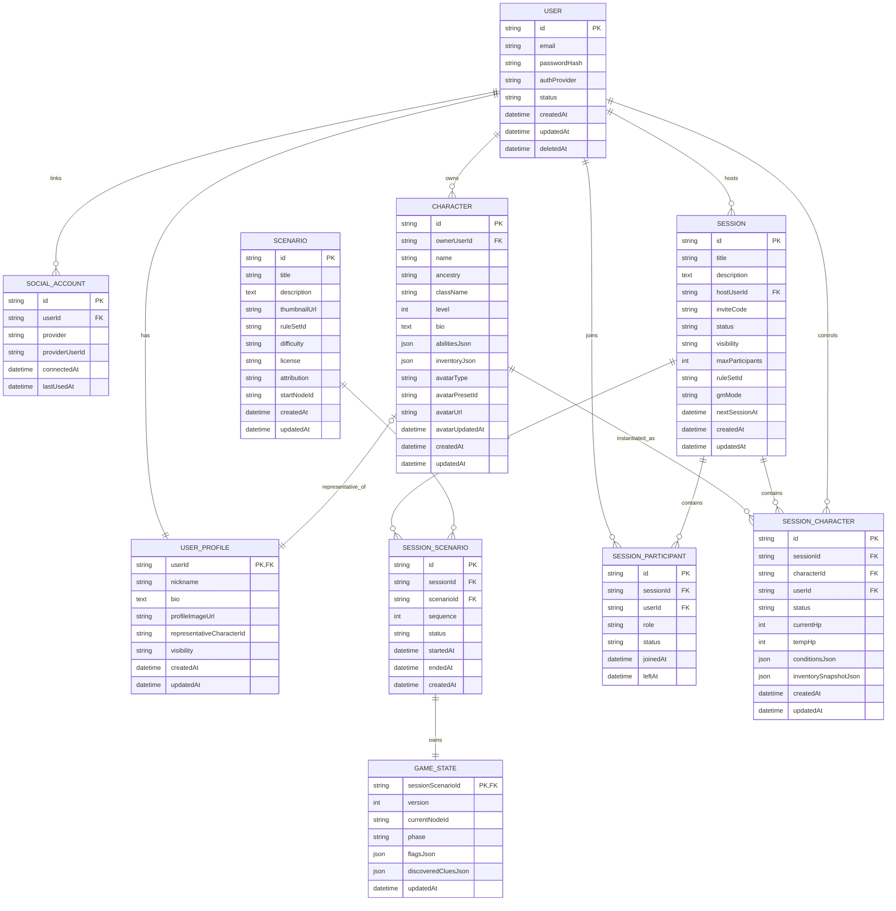

# MVP ERD 초안 - 세션 외부 서비스 모델

## 1. 목적

이 문서는 MVP 단계에서 사용할 핵심 ERD 초안을 정리한다.

특히 아래 범위를 대상으로 한다.

- 회원 / 계정 / 공개 프로필
- 세션 생성 / 탐색 / 참가 / 유지
- 시나리오 선택 및 진행 이력
- 영속 캐릭터 / 세션 런타임 캐릭터
- 최소한의 게임 상태 연결

## 2. 이번 합의의 핵심

### 2.1 세션과 시나리오

- `Session`은 사람들의 모임 / 파티 / 방이다.
- `Scenario`는 플레이할 콘텐츠다.
- 세션은 먼저 생성되고, 시나리오는 그 세션이 가져와서 플레이한다.
- 한 세션은 여러 시나리오를 순서대로 플레이할 수 있다.
- 따라서 `Session`과 `Scenario`는 직접 1:1 또는 1:N으로 묶지 않고 `SessionScenario`로 연결한다.

### 2.2 Host / Owner / GM

- MVP에서는 `owner`, `captain`, `host`를 따로 나누지 않는다.
- 세션을 만든 사람이 곧 `host`다.
- `gmMode = HUMAN`이면 host가 GM 역할도 수행한다.
- `gmMode = AI`이면 GM 역할은 AI가 수행하고, host는 방 관리자이자 주최자 역할을 맡는다.

### 2.3 Account 와 Profile

- `User`는 인증 / 계정 정보 전용이다.
- `UserProfile`은 공개 프로필 전용이다.
- `/account`와 `/users/:userId`의 책임 분리를 DB에도 반영한다.

### 2.4 일정 정보

- 다음 일정은 작은 편의 기능으로만 둔다.
- 세션 생성 / 수정 시 `nextSessionAt`을 선택적으로 입력할 수 있다.
- 필수 입력은 아니다.

### 2.5 캐릭터 이미지

- MVP에서는 캐릭터 대표 이미지를 지원한다.
- 프리셋 이미지 선택 + 사용자 업로드 이미지를 모두 허용한다.
- 복잡한 별도 미디어 테이블 대신 `Character`에 직접 컬럼을 둔다.

## 3. 테이블별 컬럼 초안

아래 표는 MVP 기준 권장 컬럼이다. 실제 구현 시 타입명이나 enum 명은 코드 컨벤션에 맞게 조정할 수 있다.

### 3.1 User

| 컬럼명 | 타입 | 설명 |
|---|---|---|
| id | string PK | 사용자 ID |
| email | string unique nullable | 로컬 로그인용 이메일. guest 계정은 null 가능 |
| passwordHash | string nullable | 로컬 로그인용 비밀번호 해시 |
| authProvider | enum | 대표 가입 방식 (`LOCAL`, `KAKAO`, `DISCORD`, `GUEST`) |
| status | enum | 계정 상태 (`ACTIVE`, `DELETED`, `SUSPENDED`) |
| createdAt | datetime | 생성 시각 |
| updatedAt | datetime | 수정 시각 |
| deletedAt | datetime nullable | 탈퇴 시각 |

### 3.2 UserProfile

| 컬럼명 | 타입 | 설명 |
|---|---|---|
| userId | string PK, FK -> User.id | 사용자와 1:1 |
| nickname | string unique | 공개 닉네임 |
| bio | text nullable | 자기소개 |
| profileImageUrl | string nullable | 프로필 이미지 URL |
| representativeCharacterId | string nullable FK -> Character.id | 대표 캐릭터 |
| visibility | enum | 공개 범위 (`PUBLIC`, `PRIVATE`) |
| createdAt | datetime | 생성 시각 |
| updatedAt | datetime | 수정 시각 |

### 3.3 SocialAccount

| 컬럼명 | 타입 | 설명 |
|---|---|---|
| id | string PK | 소셜 계정 연결 ID |
| userId | string FK -> User.id | 연결된 사용자 |
| provider | enum | `KAKAO`, `DISCORD` |
| providerUserId | string | 제공자 쪽 사용자 ID |
| connectedAt | datetime | 최초 연동 시각 |
| lastUsedAt | datetime nullable | 마지막 로그인 시각 |

권장 제약:

- `(provider, providerUserId)` unique

### 3.4 Session

| 컬럼명 | 타입 | 설명 |
|---|---|---|
| id | string PK | 세션 ID |
| title | string | 세션 제목 |
| description | text nullable | 세션 설명 |
| hostUserId | string FK -> User.id | 세션 생성자이자 host |
| inviteCode | string unique | 초대 코드 |
| status | enum | `RECRUITING`, `PLAYING`, `PAUSED`, `COMPLETED`, `DISBANDED` |
| visibility | enum | `PUBLIC`, `PRIVATE` |
| maxParticipants | int | 최대 참가 인원 |
| ruleSetId | string nullable | 룰셋 식별자 |
| gmMode | enum | `HUMAN`, `AI` |
| nextSessionAt | datetime nullable | 다음 예정 일정 |
| createdAt | datetime | 생성 시각 |
| updatedAt | datetime | 수정 시각 |

메모:

- MVP에서는 `ownerUserId`, `captainUserId`, `gmUserId`를 두지 않고 `hostUserId`로 단순화한다.
- 현재 활성 시나리오는 `SessionScenario.status = ACTIVE`로 판별한다.

### 3.5 Scenario

| 컬럼명 | 타입 | 설명 |
|---|---|---|
| id | string PK | 시나리오 ID |
| title | string | 시나리오 제목 |
| description | text nullable | 시나리오 소개 |
| thumbnailUrl | string nullable | 대표 이미지 |
| ruleSetId | string nullable | 적용 룰셋 |
| difficulty | string nullable | 난이도 |
| license | enum | 라이선스 정보 |
| attribution | string nullable | 출처 표기 |
| startNodeId | string nullable | 시작 노드 ID |
| createdAt | datetime | 생성 시각 |
| updatedAt | datetime | 수정 시각 |

### 3.6 SessionScenario

| 컬럼명 | 타입 | 설명 |
|---|---|---|
| id | string PK | 세션-시나리오 연결 ID |
| sessionId | string FK -> Session.id | 소속 세션 |
| scenarioId | string FK -> Scenario.id | 플레이할 시나리오 |
| sequence | int | 세션 내 몇 번째 시나리오인지 |
| status | enum | `PLANNED`, `ACTIVE`, `COMPLETED`, `ABANDONED` |
| startedAt | datetime nullable | 실제 시작 시각 |
| endedAt | datetime nullable | 종료 시각 |
| createdAt | datetime | 생성 시각 |

권장 제약:

- `(sessionId, sequence)` unique
- 한 세션에는 동시에 `ACTIVE` 상태의 `SessionScenario`가 1개만 존재하도록 애플리케이션 레벨에서 보장

### 3.7 SessionParticipant

| 컬럼명 | 타입 | 설명 |
|---|---|---|
| id | string PK | 참가 레코드 ID |
| sessionId | string FK -> Session.id | 참가한 세션 |
| userId | string FK -> User.id | 참가 사용자 |
| role | enum | `HOST`, `PLAYER`, `SPECTATOR` |
| status | enum | `JOINED`, `LEFT`, `KICKED` |
| joinedAt | datetime | 참가 시각 |
| leftAt | datetime nullable | 이탈 시각 |

권장 제약:

- `(sessionId, userId)` unique

### 3.8 Character

| 컬럼명 | 타입 | 설명 |
|---|---|---|
| id | string PK | 캐릭터 ID |
| ownerUserId | string FK -> User.id | 캐릭터 소유자 |
| name | string | 캐릭터 이름 |
| ancestry | string | 종족 / 혈통 |
| className | string | 직업 |
| level | int | 레벨 |
| bio | text nullable | 캐릭터 소개 |
| abilitiesJson | json/text | 능력치 |
| inventoryJson | json/text nullable | 인벤토리 |
| avatarType | enum | `DEFAULT`, `PRESET`, `UPLOAD` |
| avatarPresetId | string nullable | 프리셋 이미지 ID |
| avatarUrl | string nullable | 업로드 또는 최종 표시 이미지 URL |
| avatarUpdatedAt | datetime nullable | 이미지 수정 시각 |
| createdAt | datetime | 생성 시각 |
| updatedAt | datetime | 수정 시각 |

### 3.9 SessionCharacter

| 컬럼명 | 타입 | 설명 |
|---|---|---|
| id | string PK | 세션 캐릭터 ID |
| sessionId | string FK -> Session.id | 소속 세션 |
| characterId | string FK -> Character.id | 원본 영속 캐릭터 |
| userId | string FK -> User.id | 현재 사용 사용자 |
| status | enum | `ACTIVE`, `RETIRED`, `DEAD`, `LEFT` |
| currentHp | int | 현재 HP |
| tempHp | int | 임시 HP |
| conditionsJson | json/text nullable | 상태 이상 |
| inventorySnapshotJson | json/text nullable | 세션 기준 인벤토리 스냅샷 |
| createdAt | datetime | 생성 시각 |
| updatedAt | datetime | 수정 시각 |

메모:

- MVP에서는 `SessionCharacter`를 `Session`에 종속시킨다.
- 나중에 시나리오별 별도 상태 분리가 필요하면 `sessionScenarioId`를 추가 검토한다.

### 3.10 GameState

| 컬럼명 | 타입 | 설명 |
|---|---|---|
| sessionScenarioId | string PK, FK -> SessionScenario.id | 현재 시나리오 진행 상태 |
| version | int | 상태 버전 |
| currentNodeId | string nullable | 현재 시나리오 노드 |
| phase | enum | `LOBBY`, `EXPLORATION`, `COMBAT`, `DIALOGUE`, `REST` |
| flagsJson | json/text nullable | 진행 플래그 |
| discoveredCluesJson | json/text nullable | 수집 단서 |
| updatedAt | datetime | 갱신 시각 |

메모:

- `GameState`는 세션 전체보다 현재 플레이 중인 `SessionScenario`에 연결하는 편이 자연스럽다.
- 이렇게 두면 같은 세션에서 다음 시나리오를 시작해도 이전 진행 상태와 구분 가능하다.

## 4. MVP ERD Mermaid 코드

아래 코드는 Mermaid `erDiagram` 기준 초안이다.

## 5. 결정 배경 정리

팀원이 이 모델을 이해할 때 핵심이 되는 판단 흐름만 짧게 남긴다.

### 5.1 왜 Session 과 Scenario 를 분리했는가

- 실제 TRPG 모임은 사람들 모임이 먼저 생기고, 어떤 콘텐츠를 플레이할지는 나중에 정하는 경우가 많다.
- 같은 멤버 / 같은 방 설정을 유지한 채 다음 시나리오로 이어갈 수 있어야 자연스럽다.
- 그래서 `Session`은 파티 / 방, `Scenario`는 콘텐츠로 분리했다.
- 한 세션에서 여러 시나리오를 순서대로 플레이할 수 있도록 `SessionScenario`를 도입했다.

### 5.2 왜 Host 하나로 단순화했는가

- MVP에서는 `owner`, `captain`, `host`, `human gm`이 대부분 같은 사람이다.
- 역할을 세분화하면 API / 권한 / 화면 문구가 모두 복잡해진다.
- 따라서 MVP는 `Session.hostUserId` 하나로 단순화한다.
- `gmMode = HUMAN`이면 host가 GM 역할 수행
- `gmMode = AI`이면 AI가 GM 역할 수행, host는 방 관리 담당

### 5.3 왜 User 와 UserProfile 을 분리했는가

- `/account`는 비공개 계정 정보 관리 페이지다.
- `/users/:userId`는 공개 프로필 페이지다.
- 이 둘의 책임이 다르기 때문에 DB도 분리해두는 편이 명확하다.
- 인증 정보와 공개 정보가 한 테이블에 뒤섞이는 것을 피한다.

### 5.4 왜 nextSessionAt 을 작게 두었는가

- 다음 일정은 TRPG 운영상 자주 바뀌고, 즉시 확정되지 않는 경우가 많다.
- 사용자가 게임 종료 시 무조건 다음 일정을 입력해야 하는 UX는 부담이 크다.
- 따라서 작은 편의 기능으로만 두고, `Session.nextSessionAt`을 nullable 필드로 둔다.

### 5.5 왜 Character 이미지 테이블을 따로 두지 않았는가

- MVP에서는 프리셋 선택 + 업로드 이미지 정도면 충분하다.
- 이미지 전용 테이블까지 분리하면 구현 복잡도가 커진다.
- 우선 `Character`에 직접 `avatarType`, `avatarPresetId`, `avatarUrl`을 둔다.

## 6. 현재 구현과의 주요 차이

현재 Prisma / API 구현과 비교하면 아래 정렬 작업이 필요할 수 있다.

1. `Session.scenarioId` 직접 참조 제거 여부 검토
2. `SessionScenario` 신규 도입
3. `GameState`를 `Session` 기준이 아니라 `SessionScenario` 기준으로 옮길지 검토
4. `ownerUserId`, `captainUserId`, `gmUserId`를 `hostUserId` 중심 구조로 단순화할지 검토
5. `UserProfile` 분리 여부 반영
6. `Character` 이미지 컬럼 추가

즉, 이 문서는 "현재 코드와 완전히 일치하는 상태 문서"가 아니라, 팀이 합의한 MVP 방향을 ERD 관점으로 정리한 기준안이다.

## 7. 후속 작업 추천 순서

1. 이 문서를 기준으로 ERD 합의 확정
2. Prisma schema 수정 초안 작성
3. API 명세서의 세션 / 프로필 / 캐릭터 이미지 관련 부분 정렬
4. 프론트 라우트와 화면 책임 정리
5. 마이그레이션 전략 점검
