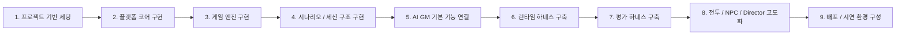

# TRPG Platform with AI Game Master - 프로젝트 작업 진행 순서

## 1. 문서 목적

이 문서는 본 프로젝트를 실제로 구현하기 위한 **권장 작업 순서**를 정리한 것이다.

핵심 원칙은 다음과 같다.

- **플랫폼 코어를 먼저 만든다**
- **게임 엔진을 붙여 진실값을 관리한다**
- **그 위에 AI GM을 얹는다**
- **마지막에 하네스와 평가 체계를 강화한다**

즉, 처음부터 AI에 모든 것을 걸지 않고, **플랫폼 → 엔진 → AI → 하네스 → 고도화** 순서로 진행한다.

---

## 2. 전체 진행 순서 요약

---

## 3. 1단계 - 프로젝트 기반 세팅

### 목표
개발 환경과 공통 구조를 먼저 만든다.

### 주요 작업
- 프론트엔드 프로젝트 생성
- 백엔드 프로젝트 생성
- 공통 타입 / 스키마 패키지 구성
- lint / formatter / 환경변수 구조 설정
- Git 브랜치 전략 및 협업 규칙 정의
- SRD/무료 콘텐츠 사용 정책 문서화
- 로컬 Ollama 연결 환경 변수 구조 정의

### 완료 기준
- 프론트와 백엔드가 각각 실행 가능
- 공통 타입을 import할 수 있음
- 팀 전체가 동일한 코드 스타일 규칙 사용 가능
- 기준 LLM 환경과 timeout 정책이 문서화됨

### 이유
초기에 구조를 잡지 않으면, 이후 모듈이 많아질수록 연결 비용이 급격히 커진다.

---

## 4. 2단계 - 플랫폼 코어 구현

### 목표
AI가 없어도 기본적인 TRPG 보조 플랫폼으로 동작하도록 만든다.

### 우선 구현 대상
- 세션 생성 / 조회 / 재개
- 게스트 세션 시작
- 초대 코드 또는 링크 기반 세션 참가
- 세션 참가자 목록 및 접속 상태 표시
- 캐릭터 생성
- 캐릭터 시트 조회 / 수정
- 인벤토리 표시
- 상태 패널
- 세션 메인 레이아웃
- 액션 입력창
- 결과 출력 영역

### 완료 기준
- 사용자가 세션을 만들고 캐릭터를 생성한 뒤, 플레이 화면에 진입 가능
- 최소 2명의 플레이어가 같은 세션에 참가 가능
- 캐릭터 시트와 현재 상태를 화면에서 확인 가능
- 한 플레이어의 로그/상태 변경이 다른 플레이어 화면에 반영됨

### 이유
플랫폼의 기본 틀이 없으면 AI가 있어도 서비스처럼 보이지 않는다.

---

## 5. 3단계 - 게임 엔진 구현

### 목표
게임의 진실값을 엔진에서 관리할 수 있게 만든다.

### 우선 구현 대상
- State Engine
- Rule Engine
- Dice Engine
- state diff 적용 로직
- 행동 가능 여부 검증 로직
- 피해 / 회복 / 상태 변화 처리
- 퀘스트 / 플래그 구조
- SRD 5e 기반 MVP 판정 구조
- 세션 단위 authoritative state version 관리

### 완료 기준
- 사용자 액션이 들어왔을 때 판정 구조를 만들 수 있음
- 주사위 결과를 적용해 상태를 변경할 수 있음
- 인벤토리 / HP / 상태이상이 일관되게 반영됨
- 동시에 들어온 액션이 서버 큐 또는 턴 순서에 따라 처리됨

### 이유
AI가 어떤 말을 하더라도 실제 게임 상태가 흔들리지 않도록 하려면 엔진이 먼저 완성되어야 한다.

---

## 6. 4단계 - 시나리오 노드 / 세션 로그 / 기억 구조 구현

### 목표
긴 세션에서도 맥락을 유지할 수 있는 구조를 만든다.

### 우선 구현 대상
- 시나리오 노드 스키마
- 현재 노드 조회 로직
- 노드 전이 조건 판정
- 턴 로그 저장 구조
- 최근 로그 조회 API
- 장기 요약 메모리 구조
- 세션 로그 화면

### 완료 기준
- 최소 1개 데모 시나리오를 노드 기반으로 진행 가능
- 각 턴의 입력 / 판정 / 상태 변화 / 결과 서사가 기록됨
- 최근 맥락과 장기 요약을 나눠 저장 가능

### 이유
긴 세션에서 AI가 앞뒤 맥락을 놓치지 않게 하려면, 기억을 시스템이 따로 관리해야 한다.

---

## 7. 5단계 - AI GM 기본 기능 연결

### 목표
AI를 플랫폼과 엔진 위에 실제로 연결한다.

### 우선 구현 대상
- Ollama client
- Interpreter
- Narrator
- 기본 Actor
- role별 prompt 관리 구조
- 기본 RAG 룰 검색 연결
- Gemma 4 계열 모델 timeout / retry / fallback 정책
- AI 호출 추적 로그

### 우선순위
1. Interpreter
2. Narrator
3. Actor
4. Director는 후순위

### 완료 기준
- 유저 자연어 입력이 structured action으로 변환됨
- 규칙 엔진 결과를 GM 서사로 출력 가능
- 기본 NPC 행동 선택 가능
- 일반 턴 응답이 기준 장비에서 30초 이내를 목표로 동작
- LLM 실패 시에도 세션 진행이 중단되지 않음

### 이유
AI GM의 핵심 플레이 루프는 먼저 **입력 해석 → 엔진 처리 → 결과 서사화**가 닫혀야 한다.

---

## 8. 6단계 - 런타임 하네스 구축

### 목표
AI를 서비스 안에서 통제 가능한 상태로 만든다.

### 우선 구현 대상
- Schema Validator
- State / Rule Validator
- Retry Controller
- Fallback Controller
- Failure Logger

### 완료 기준
- 잘못된 AI 출력이 바로 상태에 반영되지 않음
- 형식 오류 / 규칙 위반 발생 시 재시도 가능
- 재시도 실패 시 fallback으로 안전하게 처리 가능
- 실패 사례가 로그로 남음

### 이유
AI는 틀릴 수 있기 때문에, “평가”만으로는 부족하고 **실행 중 제어 장치**가 반드시 있어야 한다.

---

## 9. 7단계 - 평가 하네스 구축

### 목표
프롬프트 변경이나 구조 변경 시 성능 저하를 자동으로 잡아낸다.

### 우선 구현 대상
- evals 폴더 구조 생성
- interpreter 테스트 데이터셋
- actor 테스트 데이터셋
- narrator 테스트 데이터셋
- end-to-end 테스트셋
- scorer 함수
- Promptfoo 평가 구성

### 완료 기준
- 특정 프롬프트/모델/구조 변경 후 성능 비교 가능
- 해석 정확도, validator 실패율, fallback 비율 등을 수치화 가능

### 이유
감으로 “좋아진 것 같다”를 판단하면 품질 관리가 안 된다.

---

## 10. 8단계 - 전투 / NPC / Director 고도화

### 목표
플레이 경험을 더 게임답게 만든다.

### 주요 작업
- 전투 상태 구조 확장
- 턴 순서 관리
- 기본 공격 / 이동 / 방어 액션 구현
- NPC 행동 후보 생성 고도화
- Director 조건부 개입 로직 구현
- 힌트 시스템 구현
- 난이도 조절 실험

### 완료 기준
- 기본 전투 루프가 닫힘
- NPC가 상황에 맞는 행동을 선택함
- 플레이어가 막힐 경우 Director가 개입 가능

### 이유
이 단계부터 서비스의 “차별화”가 본격적으로 보이기 시작한다.

---

## 11. 9단계 - 배포 / 시연 환경 구성

### 목표
실제 시연 가능한 데모 환경을 만든다.

### 주요 작업
- 프론트엔드 / 백엔드 배포 환경 구성
- DB 초기 데이터 시드 구성
- Ollama 원격 연결 구조 확정
- 시연용 시나리오 및 캐릭터 데이터 준비
- 장애 대응 fallback 시연 시나리오 준비

### 완료 기준
- 시연용 URL 또는 실행 환경 준비 완료
- 최소 1개 시나리오를 처음부터 끝까지 시연 가능

### 이유
발표 단계에서는 기술 설명보다 **실제로 돌아가는 흐름**을 보여주는 것이 중요하다.

---

## 12. 실제 우선순위 정리

### P0 - 반드시 먼저
- 프로젝트 세팅
- SRD/무료 콘텐츠 정책
- 세션 / 캐릭터 시트
- 다중 플레이어 세션 참가
- 상태 엔진
- 규칙 엔진
- 주사위 엔진
- 시나리오 노드 구조
- 세션 로그 저장
- Interpreter
- Narrator
- 런타임 validator

### P1 - MVP 완성
- 기본 Actor
- 기본 전투 루프
- 룰 검색
- 시연용 시나리오
- 평가 하네스 기본 구성
- 세션 재입장 및 실시간 동기화 안정화

### P2 - 차별화 강화
- Director
- 힌트 시스템
- 전투 UI 고도화
- 장기 요약 메모리 개선
- 콘텐츠 관리 UI

### P3 - 후속 확장
- 대규모 다중 사용자 실시간 협동
- 다양한 룰셋 지원
- 운영 모니터링 고도화
- 대형 콘텐츠 확장

---

## 13. 추천 구현 순서 한 줄 버전

1. **화면과 세션부터 만든다**
2. **같은 세션에 여러 플레이어가 들어오는 흐름을 닫는다**
3. **엔진으로 판정과 상태를 먼저 고정한다**
4. **시나리오 노드와 세션 로그를 붙인다**
5. **Interpreter와 Narrator를 먼저 AI에 연결한다**
6. **AI 출력을 런타임 하네스로 감싼다**
7. **그 다음 Actor, Director, 전투 고도화로 확장한다**

---

## 14. 팀 역할 분담 권장 순서

### 기획 / PM
- 요구사항 정리
- 시나리오 노드 구조 정리
- 화면 흐름 확정

### 프론트엔드
- 세션 화면
- 캐릭터 시트
- 주사위 UI
- 로그 / 상태 패널

### 백엔드
- 세션 API
- 세션 참가 / 실시간 동기화
- 상태 엔진
- 규칙 엔진
- 세션 로그 저장
- 시나리오 노드 처리

### AI / LLM
- Ollama 연동
- Interpreter / Actor / Narrator / Director
- structured output 스키마
- 런타임 하네스 일부
- latency / timeout / fallback 추적

### QA / 콘텐츠
- 테스트 시나리오 작성
- 평가 데이터셋 작성
- 데모 시나리오 제작
- SRD/무료 콘텐츠 출처 확인

---

## 15. 구현 전 필수 보강 문서

다음 문서를 기준으로 구현 범위를 고정한다.

- `PROJECT_CONSTRAINTS_AND_SCOPE.md`
- `MVP_RULESET_SRD5E.md`
- `DATA_MODEL.md`
- `TURN_LOOP.md`
- `AI_CONTRACTS.md`
- `MVP_ACCEPTANCE_CRITERIA.md`

---

## 16. 최종 원칙

- 처음부터 모든 것을 만들려고 하지 않는다.
- 플랫폼과 엔진을 먼저 만든다.
- AI는 마지막에 “얹는” 것이 아니라, 엔진 위에 “통제된 방식으로 연결”한다.
- 긴 세션 기억은 모델이 아니라 시스템이 책임진다.
- 실패를 숨기지 말고 로그로 남겨 개선 루프를 만든다.
- SRD와 무료 공개 콘텐츠만 제품 데이터로 사용한다.

---

## 17. 한 줄 결론

**본 프로젝트의 작업 순서는 “플랫폼 코어 → 게임 엔진 → 세션/시나리오 기억 구조 → AI GM 기본 → 런타임 하네스 → 평가 하네스 → 고도화” 순으로 진행하는 것이 가장 안전하고 현실적이다.**
