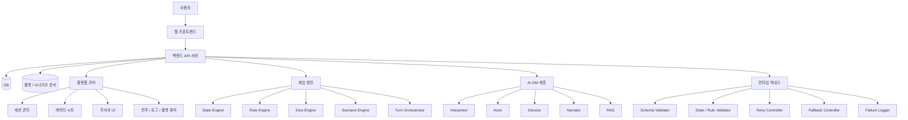

# TRPG Platform with AI Game Master

## 1. 프로젝트 개요

본 프로젝트는 **캐릭터 시트, 주사위, 룰북/컴펜디엄, 세션 로그, 전투 상태 관리**를 포함한 **웹 기반 TRPG 게임 플랫폼**에 **AI Game Master 기능**을 결합한 서비스이다.

핵심 방향은 단순한 AI 채팅 서비스가 아니라, **실제 플레이가 가능한 TRPG 플랫폼 위에서 AI가 GM 역할 일부를 수행하도록 만드는 것**이다.

이 프로젝트는 전통적인 인간 GM 중심 TRPG를 그대로 복제하는 것이 아니라, **TRPG의 자유도와 규칙 기반 상호작용을 유지하면서 GM 역할을 디지털화한 하이브리드형 플랫폼**을 목표로 한다.

---

## 2. 프로젝트 목표

### 서비스 목표

- 캐릭터 시트, 주사위, 룰북, 전투 관리, 세션 저장이 가능한 **TRPG 플랫폼 코어**를 구축한다.
- 사용자의 자연어 행동을 해석하고, 규칙에 맞는 판정 흐름과 서사를 제공하는 **AI GM 기능**을 구현한다.
- 사람 GM 없이도 시작 가능한 **솔로 플레이 또는 소규모 플레이 경험**을 제공한다.

### 기술 목표

- 호스팅 LLM 또는 로컬 LLM 어느 쪽에서도 동작 가능한 **engine-heavy, AI-light 아키텍처**를 설계한다.
- AI를 직접 신뢰하지 않고, **규칙 엔진 / 상태 엔진 / 런타임 하네스**를 통해 통제 가능한 구조를 만든다.
- 긴 세션에서도 맥락을 잃지 않도록 **세션 로그, 시나리오 노드, 상태 저장, 장기 요약 메모리**를 분리 관리한다.
- MVP 단계부터 **여러 플레이어가 같은 세션에 접속하는 온라인 플레이**를 지원한다.

### 확정 제약

- 룰셋은 D&D 5e 계열의 공개 SRD 기반 룰을 사용한다.
- 콘텐츠는 공개 SRD와 무료 공개 시나리오, 또는 팀이 직접 작성한 오리지널 시나리오만 사용한다.
- 기본 LLM은 Google AI Studio / Gemini API의 호스팅 Gemma 4 모델을 사용한다.
- 우선 모델은 `gemma-4-31b-it`이다.
- 로컬 Ollama는 오프라인 개발 또는 API 장애 대응을 위한 선택적 대체 경로로 둔다.
- 사용자 액션 1회당 응답 시간 목표는 30초 이내다.
- 로컬 룰북 PDF는 개발 참고 자료로만 두고, 저장소에는 커밋하지 않는다.

---

## 3. 주요 기능

### 3.1 플랫폼 기능

- 캐릭터 생성 / 수정 / 저장
- 캐릭터 시트 조회
- 디지털 주사위 굴림
- 판정 결과 반영
- 전투 상태 추적
- 세션 로그 저장 및 재개
- 룰북 / 컴펜디엄 조회
- 시나리오 선택 및 진행

### 3.2 AI GM 기능

- 사용자 자연어 행동 해석
- 판정 요청 문장 생성
- NPC / 몬스터 행동 선택
- 성공 / 실패 결과 서술
- 장면 분위기 및 GM 내레이션 생성
- 진행 정체 시 힌트 제공 및 전개 보조

---

## 4. 기능 관점에서의 특장점

### 4.1 AI 채팅이 아니라 플랫폼 + AI 구조

본 프로젝트는 AI 응답만 생성하는 서비스가 아니라, **캐릭터 시트, 주사위, 규칙, 상태 관리**를 먼저 갖춘 플랫폼형 구조를 전제로 한다.

### 4.2 규칙 일관성을 엔진이 보장

AI가 직접 판정과 수치 계산을 확정하지 않는다. 판정, 피해, 상태 변화, 인벤토리 반영은 **규칙 엔진과 상태 엔진**이 담당한다.

### 4.3 자유 입력을 실제 게임 시스템과 연결

사용자의 자유 자연어 입력을 **구조화된 액션 데이터**로 바꾼 뒤, 이를 규칙 엔진과 연결한다.

### 4.4 솔로 플레이와 초심자 진입성 강화

사람 GM이 없는 상황에서도 AI GM을 통해 기본 진행이 가능하도록 설계했다.

### 4.5 긴 세션에서도 맥락 유지 가능

긴 채팅 전체를 그대로 기억시키는 방식이 아니라, **현재 상태 + 현재 시나리오 노드 + 최근 세션 로그 + 장기 요약 메모리**를 AI에 제공하는 구조를 사용한다.

### 4.6 AI 오류를 통제하는 런타임 하네스

AI 출력은 바로 사용하지 않고, **스키마 검증 → 상태/규칙 검증 → 재시도 → fallback → 실패 기록** 과정을 거친 뒤 반영한다.

---

## 5. AI를 어디에 사용하는가

본 프로젝트에서 AI는 **게임의 진실값을 결정하는 존재가 아니라, 게임 진행을 자연스럽게 만드는 보조 계층**으로 사용된다.

### Interpreter

- 유저 자연어 행동을 구조화한다.
- 예: 행동 유형, 대상, 접근 방식, 판정 후보

### Actor

- NPC / 몬스터의 행동을 선택한다.
- 단, 허용 행동 후보 집합은 엔진이 제공한다.

### Director

- 플레이 정체 시 힌트 제공, 전개 속도 조절, 난이도 완급 조절을 제안한다.
- 상시 호출이 아니라 조건부로만 호출한다.

### Narrator

- 확정된 판정 결과와 상태 변화를 바탕으로 GM처럼 결과를 서술한다.

### RAG 결합

- 룰북, 시나리오, NPC 설정, 컴펜디엄 문서를 검색해 필요한 근거를 AI에 공급한다.

---

## 6. 핵심 기술

### 6.1 Google AI Studio 기반 추론 환경

MVP 기본 경로는 Google AI Studio에서 발급한 API 키로 Gemini API의 호스팅 Gemma 4 모델을 호출하는 방식이다. free tier는 개발과 시연에는 사용할 수 있지만, 실제 rate limit은 프로젝트별로 Google AI Studio에서 확인한다.

### 6.2 Structured Output

자연어를 바로 사용하지 않고, JSON 객체로 받아서 서버의 JSON Schema 또는 Zod 검증을 통과한 출력만 사용한다. Gemma 4 경로는 앱 레벨 하네스가 파싱과 검증을 책임진다.

### 6.3 Rule Engine

판정 종류, 성공/실패 효과, 수치 계산을 담당한다.

### 6.4 State Engine

캐릭터 상태, NPC 상태, 인벤토리, 위치, 퀘스트 플래그 등 현재 게임의 진실값을 관리한다.

### 6.5 Dice Engine

주사위 굴림과 보정치 계산을 처리한다.

### 6.6 Scenario Node System

시나리오를 줄글이 아니라 **상태 전이형 노드 구조**로 관리한다.

### 6.7 Session Log + Summary Memory

최근 로그와 장기 요약을 별도로 관리하여 긴 세션에서도 맥락이 유지되도록 한다.

### 6.8 Runtime Harness

AI 출력 검증, 재시도, fallback, 실패 축적을 담당한다.

### 6.9 Evaluation Harness

Promptfoo 및 자체 평가 데이터셋을 이용해 행동 해석, NPC 선택, 서사 품질을 회귀 테스트한다.

---

## 7. 전체 아키텍처

---

## 8. 세션 로그와 시나리오 노드

### 세션 로그

세션 로그는 실제 플레이 중 발생한 행동과 결과를 기록하는 구조다.

예:

- 어떤 입력이 들어왔는지
- 어떤 액션으로 해석되었는지
- 어떤 판정이 실행되었는지
- 상태가 어떻게 바뀌었는지
- 어떤 서사가 출력되었는지

세션 로그는 단순 채팅 보관이 아니라, **실제 플레이 이력과 상태 변화를 구조화해 기록하는 시스템**이다.

### 시나리오 노드

시나리오 노드는 현재 스토리가 어느 단계에 있는지, 어떤 단서가 필요한지, 어떤 조건에서 다음 장면으로 넘어가는지를 정의하는 구조다.

예:

- 현재 장면 ID
- 필수 단서
- 선택 단서
- 다음 노드 이동 조건
- 실패 시 대체 전개
- 힌트 단계

### 긴 세션에서 맥락 유지 방법

긴 세션에서는 전체 대화문을 다 AI에 넣지 않는다. 대신 아래 네 가지를 조합한다.

- 현재 상태(State)
- 현재 시나리오 노드
- 최근 세션 로그
- 장기 요약 메모리

즉, AI가 모든 것을 “기억”하는 것이 아니라, 시스템이 **필요한 기억만 정리해서 공급하는 방식**으로 동작한다.

---

## 9. 런타임 하네스

런타임 하네스는 AI를 서비스 안에서 통제하는 고삐 역할을 한다.

### 구성 요소

- Schema Validator: 형식 검증
- State / Rule Validator: 게임 상태 및 규칙 위반 검증
- Retry Controller: 잘못된 출력이면 재시도
- Fallback Controller: 계속 실패하면 안전한 방식으로 강제 처리
- Failure Logger: 실패 기록 축적

### 목적

- AI가 잘못된 행동을 해도 서비스가 무너지지 않게 함
- 같은 실수를 반복하지 않도록 실패 패턴을 수집함
- 프롬프트, validator, 테스트셋을 지속적으로 개선할 수 있게 함

---

## 10. 기술 스택

### 프론트엔드

- Next.js
- React
- TypeScript
- Tailwind CSS

### 백엔드

- NestJS
- TypeScript
- SQLite (초기)
- PostgreSQL (확장 가능)

### AI / LLM

- Google AI Studio / Gemini API
- Gemma 4 호스팅 instruct 모델
- Ollama 로컬 Gemma 4 모델(선택 대체 경로)
- JSON Schema / Zod 기반 출력 검증
- Provider 추상화

### 검증 / 하네스

- JSON Schema
- Zod
- Promptfoo
- 자체 evaluator / scorer

### 검색 / 문서 참조

- BM25 또는 키워드 검색
- 임베딩 검색(확장 고려)
- 룰북 / 시나리오 / 컴펜디엄 문서 인덱싱

---

## 11. 배포 구조

기본 배포 구조는 다음을 전제로 한다.

- 웹 서버: 프론트엔드 + 백엔드 API
- DB 서버: 세션 / 캐릭터 / 로그 저장
- 문서 저장소: 룰북 / 시나리오 / 컴펜디엄
- LLM 제공자: Google AI Studio / Gemini API

즉, **플랫폼 서버와 LLM 제공자를 분리할 수 있는 구조**를 기본으로 잡는다. API 키는 백엔드 환경변수에만 저장하고 프론트엔드에 노출하지 않는다.

---

## 12. MVP 범위

### MVP 필수 범위

- 다중 플레이어 세션 참가
- 초대 코드 또는 링크 기반 세션 입장
- 캐릭터 시트
- 디지털 주사위
- 규칙 엔진
- 상태 엔진
- 기본 시나리오 노드
- 세션 저장 / 재개
- Interpreter
- Narrator
- 런타임 validator
- 최소 1개 데모 시나리오

### 후속 고도화 범위

- Actor 고도화
- Director 고도화
- 고급 전투 UI
- 콘텐츠 관리 화면
- 운영 로그 분석 고도화
- 다중 유저 확장

---

## 13. 구현 보강 문서

구현 착수 시 다음 문서를 기준으로 세부 범위를 고정한다.

- `PROJECT_CONSTRAINTS_AND_SCOPE.md`: 확정 제약, 라이선스 정책, MVP 범위
- `MVP_RULESET_SRD5E.md`: SRD 5e 기반 MVP 룰 범위
- `DATA_MODEL.md`: 핵심 엔티티와 상태 변경 모델
- `TURN_LOOP.md`: 플레이어 입력 1회가 처리되는 서버 흐름
- `AI_CONTRACTS.md`: Google AI Studio 기반 AI 역할별 입출력 계약
- `MVP_ACCEPTANCE_CRITERIA.md`: MVP 완료 판정 기준

---

## 14. 프로젝트의 핵심 원칙

1. AI는 게임의 진실값을 결정하지 않는다.
2. 판정, 수치 계산, 상태 변경은 엔진이 담당한다.
3. AI 출력은 반드시 구조화하고 검증 후 사용한다.
4. 플랫폼 기능이 먼저고, AI는 그 위에 올라간다.
5. 긴 세션 기억은 모델이 아니라 시스템이 관리한다.
6. free tier의 rate limit과 API 장애를 고려해 engine-heavy, AI-light 구조를 유지한다.
7. 실패는 숨기지 않고 로그로 축적해 개선 루프를 만든다.
8. SRD와 무료 공개 콘텐츠만 사용하고, 권리가 불명확한 콘텐츠는 제품 데이터에 포함하지 않는다.

---

## 15. 한 줄 요약

**본 프로젝트는 캐릭터 시트, 주사위, 룰북, 세션 관리가 가능한 웹 기반 TRPG 플랫폼 위에, 규칙 엔진과 상태 엔진으로 통제되는 AI GM 기능을 결합한 하이브리드형 게임 플랫폼이다.**
