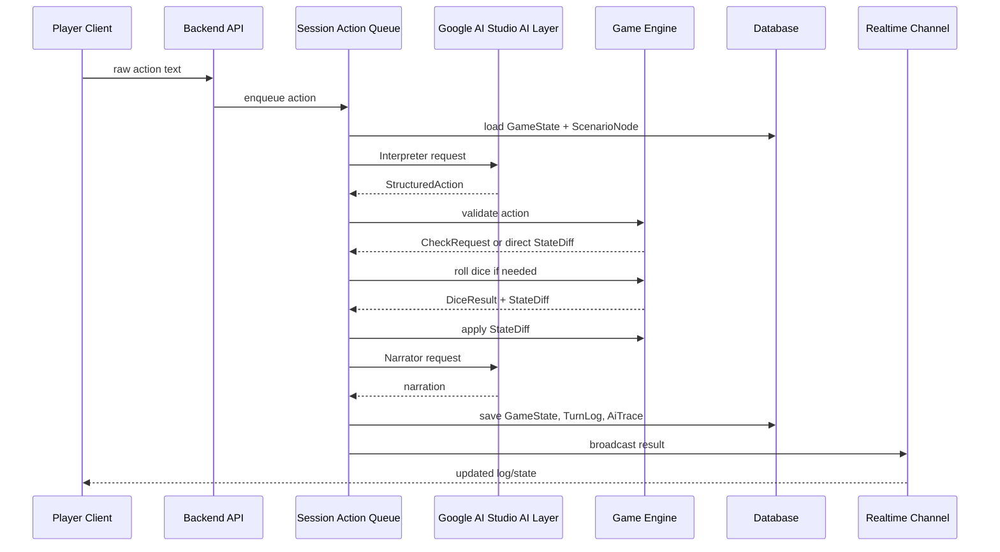

# Turn Loop - MVP 처리 흐름

## 1. 목적

이 문서는 플레이어 입력 한 번이 서버에서 어떻게 처리되는지 정의한다.

MVP의 핵심 목표는 여러 플레이어가 같은 세션에 접속하더라도, 게임 상태가 한 방향으로 일관되게 진행되도록 만드는 것이다.

정렬 메모:

- 이 문서는 `AI GM 세션`의 기본 턴 루프를 중심으로 설명한다.
- `사람 GM 세션`에서도 동일한 상태 엔진, 로그, 동기화 구조를 사용한다.
- 사람 GM 세션에서는 `GM 메시지`, `NPC 대사`, `노드 변경`, `자료 공개`, `전투 시작`이 별도 GM API를 통해 같은 저장/브로드캐스트 경로로 들어간다.
- 일반 채팅과 행동 입력은 분리된다.

## 2. 핵심 원칙

- 서버가 모든 턴을 순서대로 처리한다.
- AI는 입력 해석과 서술을 돕지만 상태를 확정하지 않는다.
- State Engine만 authoritative state를 변경한다.
- 모든 결과는 TurnLog로 저장한 뒤 클라이언트에 브로드캐스트한다.
- LLM 호출이 실패해도 세션은 멈추지 않아야 한다.

## 3. 기본 흐름



### 3.1 사람 GM 세션 보조 흐름

사람 GM 세션에서는 아래 요청들이 AI Interpreter/Narrator를 거치지 않고 서버에 직접 들어온다.

- `GM-001`: 현재 노드 변경
- `GM-002`: 자료 공개
- `GM-003`: GM 메시지/내레이션 전송
- `GM-004`: NPC 대사 전송
- `COMBAT-001`: 전투 시작

이 요청들도 최종적으로는 `TurnLog`, `ChatMessage`, `StateDiff`, 실시간 이벤트 브로드캐스트에 합류한다.

## 4. 상세 단계

### 1단계: 입력 접수

클라이언트는 다음 정보를 보낸다.

- `sessionId`
- `characterId`
- `rawText`
- `clientCreatedAt`

서버는 참가자 권한과 세션 상태를 확인한다.

### 2단계: 세션 큐 등록

동일 세션의 액션은 하나의 큐에서 순서대로 처리한다.

MVP 정책:

- exploration/dialogue: 서버 수신 순서대로 처리
- combat: 현재 턴 캐릭터의 액션만 처리
- 현재 처리 중이면 다른 액션은 pending 상태로 둔다

### 3단계: 컨텍스트 구성

Interpreter에 전달할 컨텍스트는 다음으로 제한한다.

- 현재 GameState 요약
- 현재 ScenarioNode
- 행동한 캐릭터 요약
- 주변 NPC/대상 후보
- 최근 TurnLog 3~5개 요약
- 관련 룰 조각

긴 룰북 전문이나 전체 세션 로그는 전달하지 않는다.

### 4단계: Interpreter 호출

Interpreter는 자연어를 `StructuredAction`으로 변환한다.

기본 호출 경로:

- 백엔드가 `AI_PROVIDER=google-ai-studio` 설정을 읽는다.
- Google AI Studio에서 발급한 API 키로 Gemini API의 Gemma 4 모델을 호출한다.
- raw 응답은 먼저 JSON으로 파싱하고, 그 다음 역할별 스키마로 검증한다.
- API 키와 원문 프롬프트 전문은 클라이언트로 보내지 않는다.

실패 정책:

- JSON parse 실패: 1회 재시도
- schema 실패: 1회 재시도
- confidence가 낮음: `freeform`으로 처리하고 확인 질문 생성
- timeout: fallback으로 "어떤 판정을 원하는지 선택" 응답
- rate limit 또는 quota 오류: 즉시 fallback으로 전환하고 `FailureLog`에 저장
- 네트워크 오류: 즉시 fallback으로 전환하고 `AiTrace.status`를 `fallback`, `AiTrace.validationStatus`를 `fallback`으로 저장

### 5단계: 액션 검증

Rule/State Validator가 확인한다.

- 현재 세션에 존재하는 캐릭터인가
- 대상이 현재 장면에서 접근 가능한가
- 전투 중이라면 현재 턴인가
- 지원하는 액션 타입인가
- 판정이 필요한 행동인가
- AI가 금지된 상태 변경을 시도하지 않았는가

### 6단계: 판정 생성

엔진은 `StructuredAction`과 `ScenarioNode`를 보고 `CheckRequest`를 만든다.

DC 결정 우선순위:

1. ScenarioNode에 명시된 DC
2. 룰 엔진의 기본 난이도
3. fallback DC 15

AI가 제안한 난이도는 참고만 한다.

### 7단계: 주사위 및 상태 변경

Dice Engine이 굴림을 수행하고, Rule Engine이 결과를 해석한다.

State Engine은 결과를 `StateDiff`로 만든 뒤 `baseVersion`을 검증하고 적용한다.

### 8단계: Narrator 호출

Narrator에는 확정된 정보만 전달한다.

`NarratorStateDiffSummary`는 백엔드 `StateDiff.operations` 자체가 아니라 공개 내레이션용 요약 DTO다. State Engine은 여전히 authoritative `StateDiff`를 만들고 적용하지만, Narrator에는 `stateDiffSummary`만 전달한다.

- 원본 입력
- StructuredAction
- DiceResult
- NarratorStateDiffSummary
- 현재 장면
- 출력 톤 가이드

Narrator는 새 상태, 새 단서, 새 피해량을 만들 수 없다.

### 9단계: 저장 및 브로드캐스트

서버는 다음을 저장한다.

- 갱신된 GameState
- TurnLog
- AiTrace
- FailureLog if needed

그 뒤 세션 참가자에게 이벤트를 보낸다.

## 5. 실시간 이벤트

MVP 이벤트:

```ts
type SessionEvent =
  | { type: "turn_started"; sessionId: string; actionId: string }
  | { type: "ai_processing"; sessionId: string; role: "interpreter" | "narrator" | "actor" | "npc_dialogue" | "director" | "summarizer" }
  | { type: "dice_rolled"; sessionId: string; result: DiceResult }
  | { type: "state_updated"; sessionId: string; stateVersion: number; diff: StateDiff }
  | { type: "turn_completed"; sessionId: string; turnLog: TurnLog }
  | { type: "turn_failed"; sessionId: string; message: string };
```

## 6. Timeout 정책

응답 시간 목표는 30초다.

권장 예산:

- 요청 검증 및 컨텍스트 구성: 1초
- Interpreter: 최대 10초
- 엔진 처리: 1초
- Narrator: 최대 12초
- 저장 및 브로드캐스트: 1초
- 여유: 5초

초과 시:

- Interpreter timeout: 선택지 기반 fallback
- Narrator timeout: 템플릿 기반 결과 서술
- Google AI Studio rate limit/quota 오류: LLM 재호출 없이 fallback
- Google AI Studio 일시 장애 또는 네트워크 오류: LLM 재호출 없이 fallback
- 저장 실패: 상태 적용 중단 후 오류 로그

## 7. Fallback 예시

### Interpreter 실패

```text
행동을 바로 판정하기 어렵습니다. 아래 중 가장 가까운 행동을 선택해 주세요.
1. 조사한다
2. 설득한다
3. 몰래 움직인다
4. 공격한다
```

### Narrator 실패

```text
판정 결과: 성공. {characterName}의 행동으로 단서가 발견되었습니다.
```

## 8. 동시성 기준

- `GameState.version`이 맞지 않으면 StateDiff 적용을 거절한다.
- 큐 처리 중 세션 상태가 바뀌면 액션을 재검증한다.
- 클라이언트는 서버 이벤트를 기준으로 화면을 갱신한다.
- optimistic UI는 로그 임시 표시까지만 허용한다.
