**전체 화면 구조**

- 비로그인
    - 로그인
    - 회원가입
- 로그인 후 공통
    - 홈
    - 세션 목록
    - 세션 생성
    - 내 캐릭터 목록
    - 캐릭터 생성
    - 캐릭터 상세
    - 캐릭터 수정
    - 내 프로필/계정
- 세션 진입
    - 세션 상세/참가
    - 세션 참가 시 캐릭터 선택
- 세션 플레이
    - 플레이어 메인 세션 화면
    - 인간 GM 운영 패널
    - 자료/맵/핸드아웃 표시 영역
    - 로그/채팅 영역

**공통 설계 원칙**

- 채팅과 행동 입력은 반드시 분리한다.
- 세션 정보, 캐릭터 정보, 진행 로그, 공개 자료는 한 화면에서 역할별로 다른 우선순위를 가진다.
- 사람 GM 세션과 AI GM 세션은 같은 플레이 화면을 공유하되, 입력 권한과 보조 패널만 다르게 동작한다.
- 플레이어 기준 핵심은 현재 장면, 내 캐릭터, 행동 입력, 진행 로그를 동시에 확인 가능해야 한다.
- 인간 GM 기준 핵심은 메시지 송신, NPC 발화, 노드 전환, 자료 공개, 전투 시작이 빠르게 가능해야 한다.
- 세션 상태 표기는 `lobby`, `playing`, `paused`, `completed` 기준으로 통일하고, 상태별 입력 가능 범위를 화면에서 명확히 안내한다.

# 로그인 화면

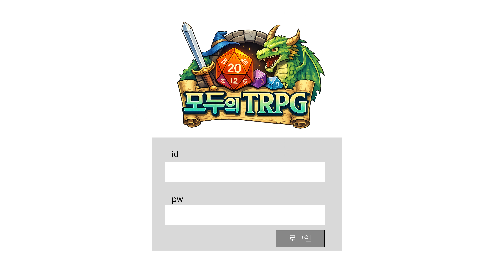

- 목적: 기존 계정 로그인 및 OAuth 진입
- 주요 사용자: 비로그인 사용자
- 주요 구성 요소
    - 이메일 입력
    - 비밀번호 입력
    - 로그인 버튼
    - 회원가입 이동 링크
- 주요 동작
    - 이메일 로그인
- 연동 API
    - 로그인 API
- 예외 상태
    - 이메일/비밀번호 오류
    - 탈퇴/정지 계정 차단
- 화면 메모
    - MVP에서는 단순 1컬럼 카드형 레이아웃 권장
    - 로그인 성공 시 홈 또는 이전 진입 페이지로 이동

# 회원가입 화면

- 목적: 이메일 기반 회원가입
- 주요 구성 요소
    - 이메일
    - 비밀번호
    - 이름/닉네임
    - 회원가입 버튼
- 연동 API
    - POST /api/v1/users/register
- 검증 포인트
    - 이메일 형식
    - 비밀번호 길이/정책
    - 이메일 중복
- 예외 상태
    - 필수값 누락
    - 중복 이메일
- 화면 메모
    - 가입 완료 후 로그인 처리

# 홈 화면

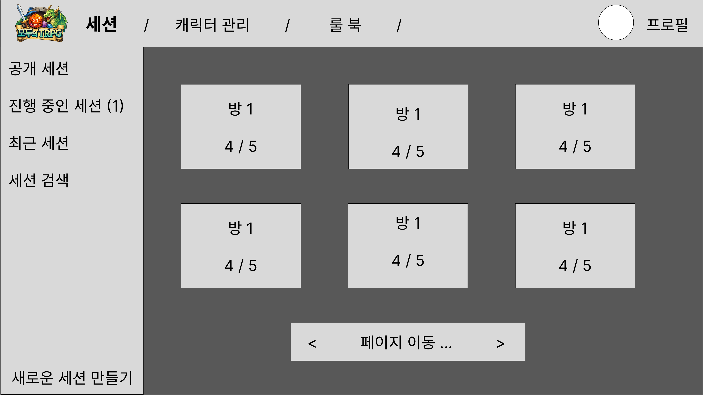

- 목적: 서비스 첫 진입 후 주요 동선 제공
- 주요 구성 요소
    - 상단 네비게이션
    - 내 진행 중 세션 바로가기
    - 세션 찾기 버튼
    - 세션 생성 버튼
    - 내 캐릭터 바로가기
    - 최근 활동 또는 공지
- 주요 동작
    - 세션 목록 이동
    - 세션 생성 이동
    - 캐릭터 목록 이동
- 화면 메모
    - MVP에서는 대시보드보다 빠른 진입 허브 역할이 중요

- 목적: 참여 가능한 세션 탐색
- 주요 구성 요소
    - 검색/필터 바
    - 상태 필터 `lobby`, `playing`, `paused`, `completed`
    - 모드 필터 `single`, `multi`
    - 카드형 또는 테이블형 세션 목록
- 목록 항목
    - 세션 제목
    - 모드
    - 상태
    - 호스트
    - 현재 인원/최대 인원
    - 생성일
    - 참가 가능 여부 배지
- 주요 동작
    - 세션 상세 이동
    - 참여 가능 세션 빠른 참가
- 연동 API
    - 세션 목록 조회 API
- 예외 상태
    - 결과 없음
    - 권한 없는 비공개 세션 제외
- 화면 메모
    - 목록에서는 메타 정보만 노출하고 상세 로그는 노출하지 않음

# 세션 생성 화면

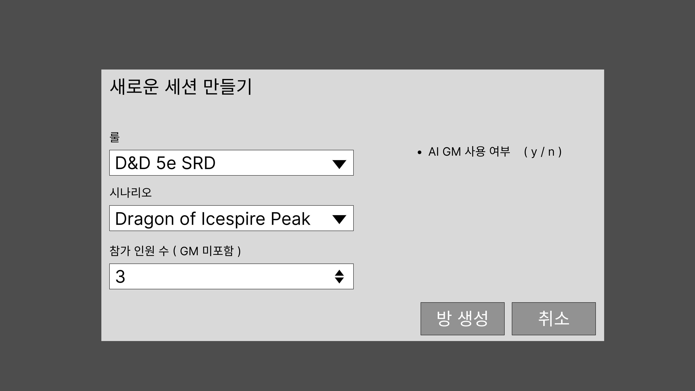

- 목적: 새로운 TRPG 세션 생성
- 주요 구성 요소
    - 세션 제목
    - 진행 방식 선택 AI GM / HUMAN GM
    - 모드 선택 SINGLE / MULTI
    - 최대 인원 수
    - 룰북/시나리오 선택
    - 공개 여부
    - 생성 버튼
- 주요 동작
    - 세션 생성
    - 생성 후 세션 대기실 이동
- 연동 API
    - 세션 생성 API
- 검증 포인트
    - 최대 인원 제한
    - 필수값 누락
- 화면 메모
    - 생성 시 자동으로 HOST 권한 부여
    - AI GM 세션과 인간 GM 세션의 분기점이 되는 화면

# 캐릭터 관리 화면

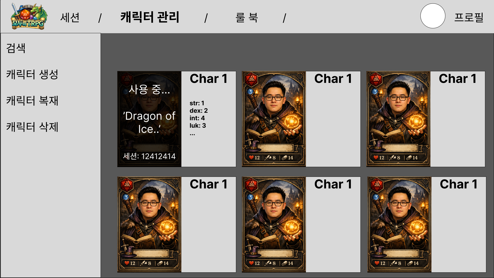

- 목적: 캐릭터 관리 진입점
- 주요 구성 요소
    - 캐릭터 카드 목록
    - 정렬/필터
    - 캐릭터 생성 버튼
- 카드 정보
    - 이름
    - 클래스/종족
    - 레벨
    - HP
    - 대표 이미지
    - 참여 중 여부
- 주요 동작
    - 상세 보기
    - 수정
    - 복제
    - 삭제
- 연동 API
    - 캐릭터 목록 조회 API
- 화면 메모
    - 세션 참가 전 선택과 연결되는 핵심 화면

# 캐릭터 상세 화면

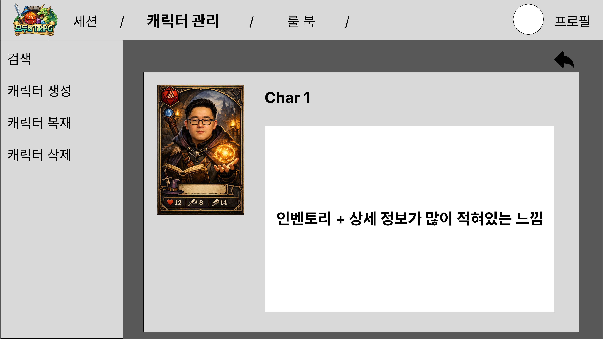

- 목적: 영속 캐릭터 정보 상세 조회
- 주요 구성 요소
    - 캐릭터 프로필 헤더
    - 능력치 패널
    - 스킬 패널
    - 장비 패널
    - 소개/이미지
- 주요 동작
    - 수정 이동
    - 삭제
    - 세션 참가용 선택
- 연동 API
    - 캐릭터 상세 조회 API
- 화면 메모
    - 세션 중 실시간 상태와는 분리된 기본 시트 개념으로 설계

# 캐릭터 생성 화면

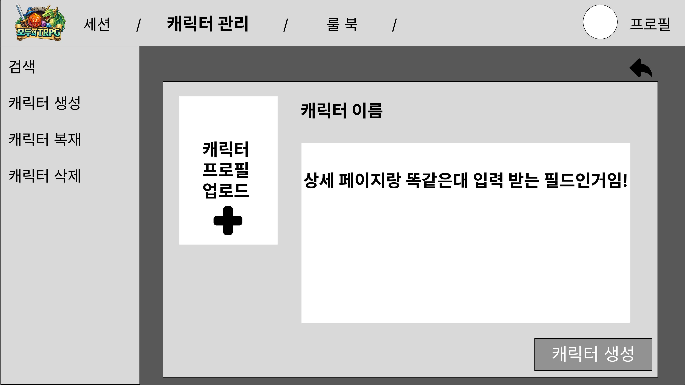

- 목적: 캐릭터 생성 및 수정
- 주요 구성 요소
    - 기본 정보 이름, 종족, 클래스, 배경
    - 능력치 입력
    - HP/AC/Speed
    - 스킬
    - 장비/인벤토리
    - 소개/이미지
    - 저장 버튼
- 주요 동작
    - 신규 생성
    - 수정 저장
- 연동 API
    - 캐릭터 생성 API
    - 캐릭터 수정 API
- 검증 포인트
    - 룰 기반 수치 검증
    - 세션 PLAYING 중 수정 제한
- 화면 메모
    - 생성과 수정은 같은 폼을 재사용하고 모드만 다르게 두는 편이 좋음

# 세션 캐릭터 선택 화면

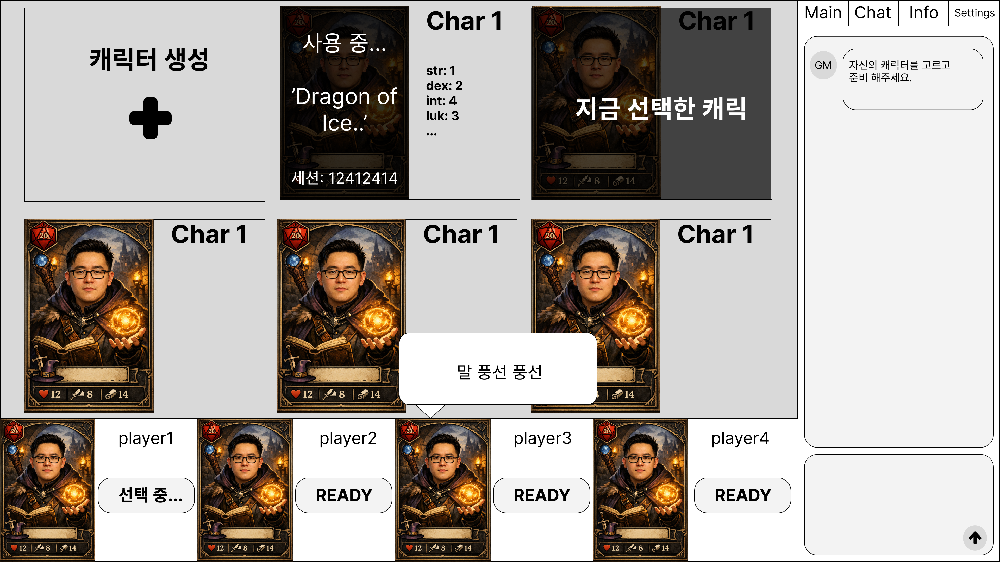

- 목적: 세션에서 사용할 캐릭터를 선택
- 주요 구성 요소
    - 내 캐릭터 목록 카드
    - 캐릭터 요약 이름, 클래스, 종족, 레벨, HP
    - 선택 버튼
    - 새 캐릭터 생성 버튼
- 주요 동작
    - 캐릭터 선택 후 세션 참가 완료
- 연동 API
    - 캐릭터 목록 조회 API
    - 세션 참가 API 또는 참가 후 캐릭터 연결 API
- 검증 포인트
    - 본인 소유 여부
    - 세션당 1캐릭터
    - 이미 사용 중인 캐릭터 방지
- 화면 메모
    - 참가와 동시에 선택 방식이 MVP에 가장 적합

# 세션 대기실 화면

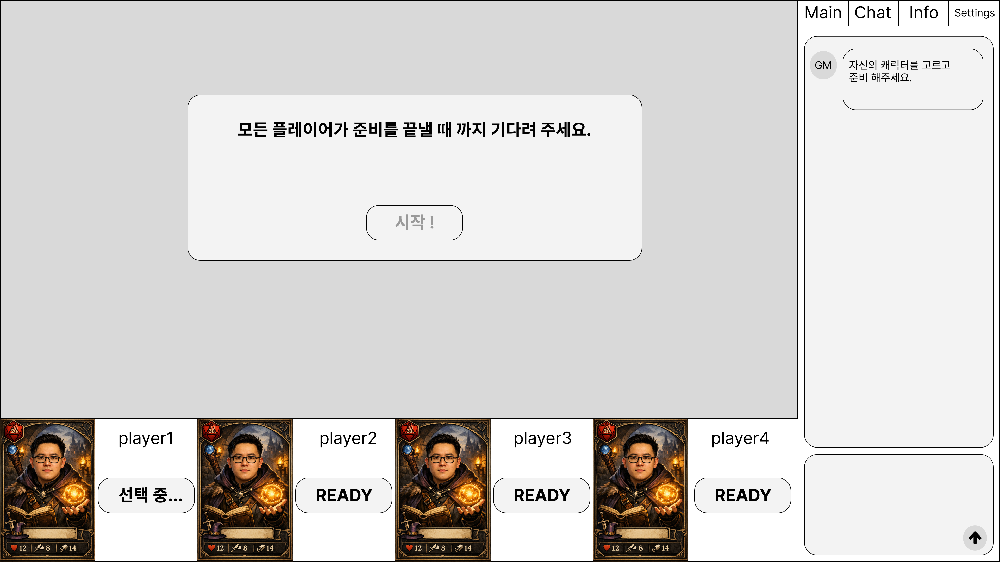

- 목적: 세션 입장 직전 정보 확인 및 참가
- 주요 구성 요소
    - 세션 제목
    - 룰북/시나리오 요약
    - 현재 인원
    - 상태
    - 호스트/GM 정보
    - 참가 버튼
- 주요 동작
    - 참가 요청
    - 캐릭터 선택 모달 또는 다음 화면 이동
- 연동 API
    - 세션 상세 조회 API
    - 세션 참가 API
- 예외 상태
    - 정원 초과
    - 중복 참가
    - 진행 중 세션
- 화면 메모
    - 참가 시 캐릭터 선택과 연결되므로 단일 흐름으로 묶는 것이 좋음

# 시나리오 화면

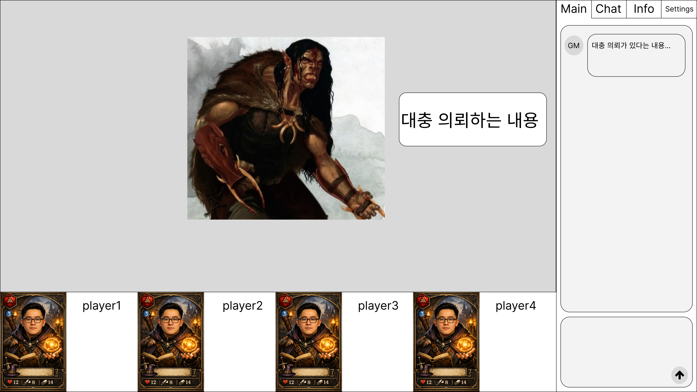

- 목적: 플레이어가 실제 게임을 진행하는 핵심 화면
- 주요 구성 요소
    - 상단: 세션 정보, 상태, 현재 턴/라운드
    - 좌측 또는 중앙: 메인 진행 로그
    - 우측: 내 캐릭터 요약 패널
    - 하단 1: 일반 채팅 입력
    - 하단 2: 행동 입력 영역
    - 보조 영역: 공개 자료/맵/이미지
- 주요 동작
    - 일반 채팅 전송
    - 행동 입력 전송
    - 명령어 입력 /roll, /attack, /check
    - AI 응답/GM 메시지 수신
- 연동 API
    - CHAT-002
    - ACTION-001
    - WebSocket 실시간 수신
- 핵심 UI 규칙
    - 채팅 입력창과 행동 입력창은 물리적으로 분리
    - 행동 입력에는 명령어 힌트/자동완성 제공 가능
    - 현재 세션 상태 WAITING / PLAYING / ENDED에 따라 입력 가능 여부 변경
- 화면 메모
    - MVP 기준 가장 중요한 화면
    - 플레이어는 현재 장면, 내 상태, 입력, 결과를 동시에 봐야 함

# 탐색 화면

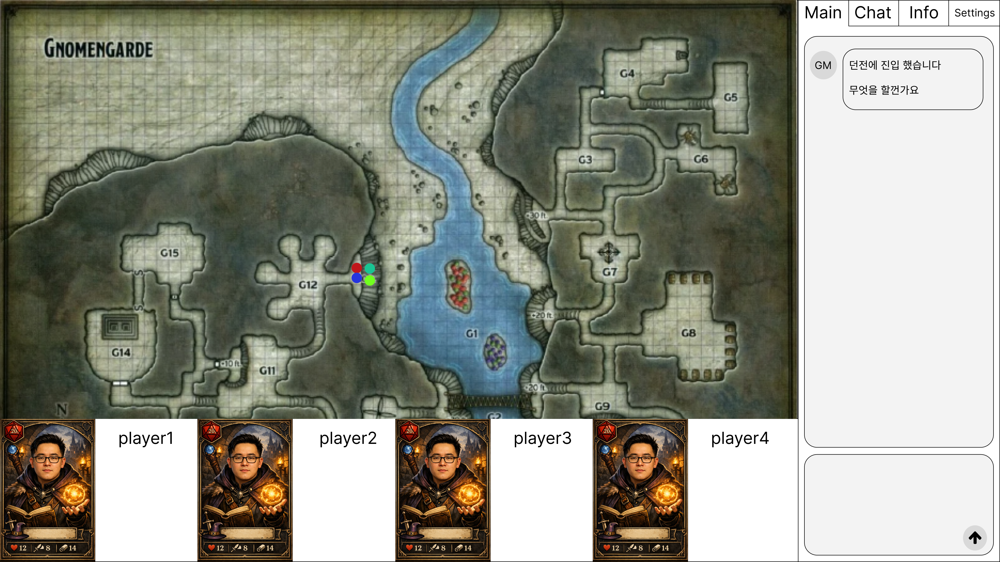

# 전투 화면

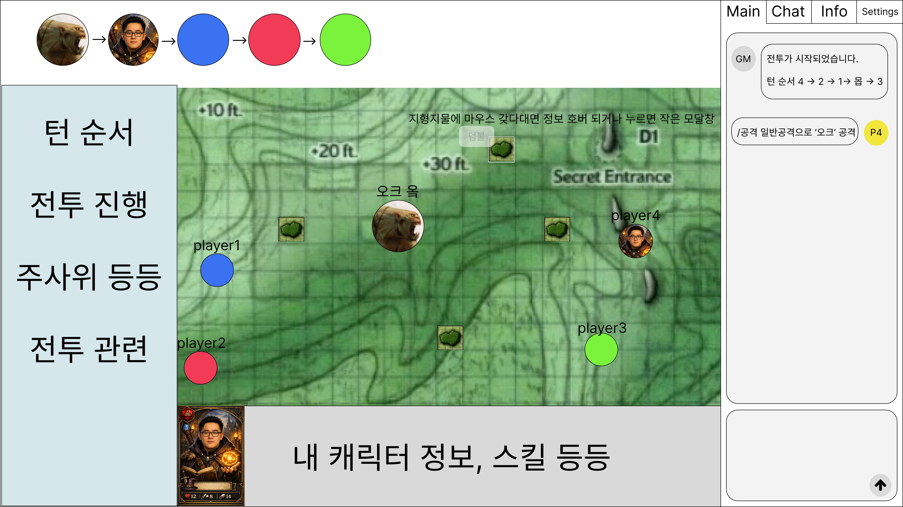

**인간 GM 운영 패널**

- 목적: 인간 GM이 세션을 직접 진행
- 주요 사용자: 사람 GM
- 주요 구성 요소
    - GM 메시지 입력 박스
    - NPC 대사 입력 박스
    - 현재 노드 변경 컨트롤
    - 자료 공개 버튼
    - 전투 시작 버튼
    - 참가자/엔티티 관리 패널
- 주요 동작
    - GM 메시지 전송
    - NPC 이름으로 발화 전송
    - 노드 변경
    - 자료 공개
    - 전투 시작
- 연동 API
    - GM-003
    - GM-004
    - GM-001
    - GM-002
    - COMBAT-001
- 화면 메모
    - 플레이어 화면 위에 덧붙는 별도 운영 패널로 설계하는 편이 좋음
    - 데스크톱에서는 우측 사이드 패널, 모바일에서는 탭/드로어 권장

**자료/맵/핸드아웃 표시 화면 영역**

- 목적: 노드 또는 GM 조작에 따라 시각 자료 제공
- 주요 구성 요소
    - 이미지/맵/문서 뷰어
    - 설명 텍스트
    - 닫기 또는 축소 버튼
- 주요 동작
    - 자동 공개
    - GM 수동 공개
- 연동 API/이벤트
    - GM-002
    - 노드 변경 후 동기화 이벤트
    - WebSocket 브로드캐스트
- 화면 메모
    - 채팅 흐름을 끊지 않도록 모달 또는 사이드 패널 구조 권장
    - 모든 플레이어에게 동기화되어야 함

**세션 플레이 화면 레이아웃 권장안**

- 상단 바
    - 세션명
    - 모드
    - GM 유형 AI / HUMAN
    - 상태
    - 현재 라운드/턴
- 좌측
    - 메인 진행 로그
    - GM 메시지 / AI 서술 / NPC 대사
- 우측
    - 내 캐릭터 요약
    - 참여자 목록
    - 공개 자료 패널
- 하단
    - 일반 채팅 입력
    - 행동 입력
- GM일 경우 추가
    - 우측 접이식 운영 패널

**권한별 화면 차이**

- 플레이어
    - 행동 입력 가능
    - 일반 채팅 가능
    - 공개 자료 열람 가능
    - GM 운영 기능 불가
- 인간 GM
    - GM 메시지 입력 가능
    - NPC 대사 입력 가능
    - 노드 변경 가능
    - 자료 공개 가능
    - 전투 시작 가능
- AI GM 세션 참여자
    - AI 전용 보조 기능 사용 가능
    - 멀티 세션에서는 반장/개인 턴 권한 분기 필요

**상태별 화면 제어**

- LOBBY
    - 채팅 일부 허용
    - 행동 입력 비활성 또는 제한
    - 참가/캐릭터 선택 가능
- PLAYING
    - 채팅/행동 입력 활성
    - 캐릭터 변경 제한
    - 자료/로그/주사위/AI 처리 상태 실시간 반영
- PAUSED
    - 행동 입력 중단
    - 재개 대기 안내 표시
    - 로그와 공개 자료는 계속 조회 가능
- COMPLETED
    - 입력 차단
    - 로그/요약 중심 조회 화면 전환

**디자인/UX 핵심 포인트**

- TRPG답게 서사 로그가 중심이고, 폼 화면은 최대한 단순하게
- 정보 우선순위는 현재 장면 > 행동 결과 > 내 캐릭터 > 일반 채팅
- 사람 GM이 있을 때는 운영 패널이 강력해야 하고, 플레이어 화면은 복잡해지지 않아야 함
- 모바일에서는 세션 플레이 화면을 탭 구조로 분리
    - 메인
    - 캐릭터
    - 자료
    - 채팅

**MVP 우선 구현 화면**

1. 로그인
2. 회원가입
3. 세션 목록
4. 세션 생성
5. 세션 상세/참가 + 캐릭터 선택
6. 캐릭터 목록
7. 캐릭터 생성/수정
8. 플레이어 메인 세션 화면
9. 인간 GM 운영 패널
10. 자료 표시 영역