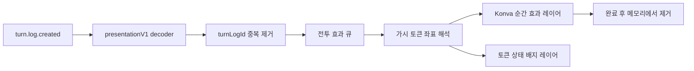

# VTT 전투 효과 구현 계획

작성일: 2026-08-08

상태: 구현 완료 (2026-08-08 검증)

연관 기준 문서:

- [`structure/RUNTIME_SESSION_TURN_FLOW.md`](../structure/RUNTIME_SESSION_TURN_FLOW.md)
- [`structure/SCREEN.md`](../structure/SCREEN.md)
- [`rules/ARCHITECTURE_RULES.md`](../rules/ARCHITECTURE_RULES.md)
- [`rules/CONTENT_LICENSE_RULES.md`](../rules/CONTENT_LICENSE_RULES.md)
- [`rules/FRONTEND_DISPLAY_RULES.md`](../rules/FRONTEND_DISPLAY_RULES.md)
- [`trpg_combat_ui_implementation_plan.md`](trpg_combat_ui_implementation_plan.md)

## 1. 결론

현재 VTT 구조에서도 근접 공격, 투사체, 주문, 회복, 피해 숫자, 상태이상 효과를 구현할 수 있다. `react-konva`로 구성된 기존 전투맵에 비상태성 전투 효과 레이어를 추가하면 되므로 맵 렌더러를 교체할 필요는 없다.

구현 난점은 애니메이션 자체보다 다음 세 가지에 있다.

1. 서버가 확정한 전투 결과를 연출에 필요한 단위로 전달하는 타입 계약
2. 여러 클라이언트가 같은 사건을 같은 순서로 한 번만 재생하는 큐와 중복 제거
3. 복합 피해, 저항·면역·약점, 상태 적용·해제를 규칙 정보 손실 없이 표시하는 방식

따라서 `TurnLog → presentationV1 → 클라이언트 효과 큐 → Konva 효과 레이어` 흐름을 새로 만들고, 게임 상태와 연출 상태를 분리한다. 첫 체감이 큰 피해·회복 숫자와 상태 아이콘을 먼저 완성한 뒤 근접 공격, 투사체, 주문 순으로 확장한다.

## 2. 목표와 범위

### 목표

- 플레이어가 로그를 읽기 전에 누가 누구에게 무엇을 했고 어떤 결과가 발생했는지 이해한다.
- 모든 정규 피해 타입을 고유한 색상과 아이콘으로 구별한다.
- 상태이상은 토큰 위 아이콘과 적용·해제 연출로 알아볼 수 있게 한다.
- 서버 권위 상태, 기존 전투 처리, VTT 좌표를 효과 연출이 변경하지 않는다.
- 같은 전투 결과를 모든 참여 클라이언트에서 중복 없이 일관된 순서로 재생한다.
- 색각, 광과민성, 멀미를 고려해 색상 외 단서와 모션 감소 설정을 제공한다.

### 1차 포함 범위

- 근접 공격의 돌진, 공격 궤적, 피격, 빗나감, 치명타 연출
- 화살·볼트·투척물 등 투사체 이동과 충돌 연출
- 단일·다중 대상 주문의 `bolt`, `beam`, `burst`, `cone`, `line`, `aura` 범용 프리셋
- 일반 HP 회복, 임시 HP, 전투불능 회복 연출
- 피해·회복 숫자, 저항·면역·약점 표시
- SRD 5.1 정규 상태 15종과 프로젝트 런타임 상태의 아이콘
- 상태 적용·해제 순간 연출과 토큰의 지속 상태 배지
- 효과 강도 `전체 / 축소 / 끔` 설정
- 재접속, 지연, 장시간 전투를 고려한 큐 제한과 중복 제거

### 제외 범위

- 3D 전투맵이나 물리 기반 파티클 엔진 도입
- 효과 애니메이션이 실제 명중, 피해, 위치, 상태를 계산하는 구조
- 모든 주문에 개별 제작한 전용 애니메이션 제공
- 지속 지형 효과의 고급 셰이더와 유체 시뮬레이션
- 카메라 강제 이동, 화면 전체 흔들림, 과도한 섬광
- 효과음과 음성 연출. 다만 향후 추가할 수 있도록 프리셋 식별자는 유지한다.

## 3. 현재 구조 기준 판단

### 활용 가능한 기반

- `fe/src/components/battleMap/BattleMapCore.tsx`는 `react-konva`의 `Stage`, `Layer`, `Group`을 사용한다.
- 토큰은 `BattleMapTokenLayer`에서 맵 좌표를 기준으로 렌더링된다.
- 토큰 뒤에는 시야 마스크, 측정·핑 오버레이, 안개 레이어가 순서대로 존재한다.
- `shared-types/src/dto/api/gameplay.dto.ts`의 전투 참여자는 `sessionEntityId`, `tokenId`, HP, 상태 정보를 가진다.
- 공격과 주문 결과는 `TurnLog.structuredAction`에 일부 구조화되어 있고 `turn.log.created`로 실시간 전달된다.
- 프론트엔드는 이미 TurnLog 이벤트에서 주사위 오버레이를 파생한다.

### 현재 부족한 정보

- `damageTotal` 하나만으로는 복합 피해의 타입별 적용량을 알 수 없다.
- 원래 굴린 피해와 실제 HP에 적용된 피해가 명확히 분리되지 않는다.
- 내성 성공, 저항, 면역, 약점이 최종 숫자에 어떤 영향을 주었는지 타입화되어 있지 않다.
- `conditions: string[]`에는 사용자용 상태 ID뿐 아니라 `speed:zero` 같은 내부 런타임 태그도 섞일 수 있다.
- 동시 수신, 재접속, 과거 로그 로딩 때 어떤 효과를 재생해야 하는지 계약이 없다.

### 레이어 배치 원칙

전투 효과는 토큰보다 위에 보여야 하지만, 플레이어가 볼 수 없는 토큰이나 위치를 드러내면 안 된다. 기본 순서는 다음과 같이 둔다.

```text
배경/지형/오브젝트
→ 이동·사거리 표시
→ 토큰
→ 지속 상태 배지
→ 순간 전투 효과와 숫자
→ 플레이어 시야 마스크
→ 측정·핑 등 도구 오버레이
→ 안개
```

효과 레이어는 `listening={false}`로 만들어 맵 선택, 드래그, 측정 입력을 가로채지 않는다. 효과 좌표는 렌더링 당시 클라이언트가 볼 수 있는 토큰에서만 계산하며, 숨겨진 토큰 좌표를 효과 payload로 새로 노출하지 않는다.

## 4. 설계 원칙

1. **서버 결과가 먼저다.** 효과는 확정된 결과를 표현할 뿐 규칙 판정이나 HP를 바꾸지 않는다.
2. **연출과 상태를 분리한다.** 효과 재생을 위해 토큰 좌표, HP, 조건을 임시로 변경하지 않는다.
3. **색상만 사용하지 않는다.** 피해는 색상, 아이콘, 숫자를 함께 표시하고 상태는 아이콘과 사용자용 이름을 함께 제공한다.
4. **결과 단위를 보존한다.** 복합 피해와 다중 대상 결과를 하나의 총합으로 뭉개지 않는다.
5. **범용 프리셋을 우선한다.** `전달 방식 × 피해 표현 × 결과 보정`을 조합하고 대표 주문만 전용 프리셋으로 덮어쓴다.
6. **짧고 겹칠 수 있게 만든다.** 일반 행동은 약 0.25~0.8초 안에 핵심을 전달하며, 전투 진행을 막는 모달 애니메이션으로 만들지 않는다.
7. **표시 권한을 넘지 않는다.** 연출 데이터는 기존 시야와 권한으로 볼 수 없는 대상, 위치, 내부 ID를 새로 공개하지 않는다.
8. **아이콘은 로컬 자산으로 제공한다.** 플레이 중 외부 아이콘 API에 의존하지 않는다.

## 5. 연출 조합 모델

하나의 행동 연출은 아래 세 축을 조합한다.

```text
DeliveryPreset × DamagePresentation × OutcomeModifier
```

- `DeliveryPreset`: 근접, 투사체, 광선, 폭발, 원뿔, 직선, 오라처럼 효과가 이동하고 퍼지는 방식
- `DamagePresentation`: 화염, 냉기, 참격처럼 색상, 아이콘, 입자 모양을 결정하는 피해 표현
- `OutcomeModifier`: 빗나감, 치명타, 저항, 면역, 약점, 내성 성공처럼 강도와 보조 문구를 바꾸는 결과 보정

예를 들어 화염 화살은 `projectile × fire × hit`, 화염구에 내성 성공한 대상은 `burst × fire × saved_half`, 냉기 면역 대상은 `bolt × cold × immune` 조합으로 표현한다.

## 6. 효과 카탈로그

### 6.1 근접 공격

기본 시퀀스:

1. 공격자 토큰을 80~120ms 강조한다.
2. 공격자가 대상 방향으로 토큰 크기의 약 10~18%만큼 돌진한다.
3. 공격 시점에 피해 타입별 궤적과 충돌 효과를 표시한다.
4. 대상에 짧은 국소 흔들림 또는 명도 플래시를 적용한다.
5. 피해 숫자와 결과 보정을 표시한다.
6. 공격자 표현 좌표를 원래 위치로 복귀한다.

세부 규칙:

- 돌진은 Konva 표현 transform만 사용하며 VTT 토큰 좌표를 변경하지 않는다.
- 빗나감은 궤적이 대상 옆을 통과하고 대상 흔들림을 생략한다.
- 치명타는 80~100ms의 짧은 hit-stop과 이중 충격 링을 추가한다.
- 공격자와 대상이 같은 좌표이거나 대상을 찾을 수 없으면 돌진 없이 숫자·아이콘만 표시한다.

### 6.2 투사체

범용 프리셋:

| 프리셋 | 용도 | 표현 |
| --- | --- | --- |
| `arrow` | 활 | 가는 몸체, 깃, 짧은 잔상 |
| `bolt` | 석궁·마법 탄환 | 짧고 빠른 직선체, 강한 충돌점 |
| `thrown` | 단검·도끼·병 | 회전 또는 포물선에 가까운 곡선 이동 |
| `orb` | 속성 구체 | 피해 타입 색상의 코어와 꼬리 |

세부 규칙:

- 이동 시간은 거리에 따라 180~450ms 범위로 제한한다.
- 빗나감은 대상 중심을 통과하지 않고 약 0.5칸 옆으로 지나간다.
- 다중 투사체는 60~100ms 간격으로 발사하되 결과 숫자는 읽을 수 있게 묶는다.
- 투사체 자체보다 충돌 순간의 피해 타입 표현을 더 강하게 한다.

### 6.3 주문

범용 형태:

| 형태 | 대표 용도 | 핵심 표현 |
| --- | --- | --- |
| `bolt` | 단일 표적 주문 | 시전자에서 대상까지 빠른 에너지 탄환 |
| `beam` | 지속 광선 | 두 지점을 연결하는 빛줄기와 맥동 |
| `burst` | 범위 폭발 | 중심에서 바깥으로 확장하는 링과 파편 |
| `cone` | 원뿔 범위 | 시전자 전방으로 넓어지는 입자 부채꼴 |
| `line` | 직선 범위 | 지정 방향을 한 번에 관통하는 띠 |
| `aura` | 자신·주변 효과 | 토큰 둘레의 상승 링과 반복 맥동 |
| `ground` | 지면 지정 | 지정 영역의 짧은 표식과 잔류 테두리 |

`spellId`에 대응하는 전용 `presetId`가 있으면 이를 사용하고, 없으면 주문의 범위 형태와 주요 피해 타입으로 범용 프리셋을 선택한다. 1차 전용 프리셋 후보는 화염 화살, 마법 화살, 작열 광선, 불타는 손길, 천둥파, 화염구, 달빛 광선, 번개 줄기다.

지속 지형 주문은 1차에서 생성 순간만 표현한다. 매 턴 적용되는 피해는 같은 `presentationV1` 결과로 재생하며, 고급 잔류 효과는 후속 단계로 둔다.

### 6.4 회복과 임시 HP

| 종류 | 색상/아이콘 | 표현 | 숫자 |
| --- | --- | --- | --- |
| HP 회복 | 청록·초록, `heart-plus` | 위로 오르는 빛 입자와 안쪽으로 모이는 링 | `+N` |
| 임시 HP | 하늘색, `shield` | 토큰을 감싸는 반투명 방패 | `보호 +N` |
| 전투불능 회복 | 금색, `revive` | 짧은 수직 광선과 바깥으로 퍼지는 링 | `회복 +N` |

- 숫자는 요청량이나 주사위 총합이 아니라 실제로 증가한 HP를 표시한다.
- 최대 HP 상태에서 변화가 없으면 `+0` 대신 `회복 없음`을 작게 표시하거나 효과를 생략한다.
- 임시 HP는 일반 회복과 합치지 않는다.

### 6.5 피해 타입 시각 사전

정규 피해 타입 13종은 모두 고유 색상과 고유 아이콘을 가진다. `untyped`는 규칙상 정규 피해 타입이 아니라 오래된 데이터나 예외 처리를 위한 중립 fallback이다.

| 피해 타입 | 대표 색상 | 아이콘 키 후보 | 입자·충돌 모티프 |
| --- | --- | --- | --- |
| 산성 `acid` | `#A3E635` | `game-icons:acid-blob` | 액체 방울, 부식 연기 |
| 타격 `bludgeoning` | `#B08968` | `game-icons:hammer-drop` | 먼지, 둔중한 원형 충격파 |
| 냉기 `cold` | `#22D3EE` | `game-icons:ice-bolt` | 얼음 파편, 서리 결정 |
| 화염 `fire` | `#FF6B35` | `game-icons:flame` | 불꽃, 불티, 위로 오르는 열기 |
| 역장 `force` | `#8B5CF6` | `game-icons:implosion` | 공간 왜곡, 안팎으로 겹치는 링 |
| 번개 `lightning` | `#FACC15` | `game-icons:lightning-arc` | 갈라지는 전기 가지 |
| 사령 `necrotic` | `#6D28D9` | `game-icons:death-skull` | 안으로 빨려 드는 어두운 안개 |
| 관통 `piercing` | `#94A3B8` | `game-icons:plain-dagger` | 한 점으로 모이는 선형 파편 |
| 독성 `poison` | `#16A34A` | `game-icons:poison-bottle` | 독성 기포, 낮게 번지는 안개 |
| 정신 `psychic` | `#EC4899` | `game-icons:brain` | 동심원 정신파, 잔상 분리 |
| 광휘 `radiant` | `#FFF1A8` | `game-icons:sunbeams` | 흰색·금색 방사광 |
| 참격 `slashing` | `#BE123C` | `game-icons:axe-swing` | 대각선 베기 자국 |
| 천둥 `thunder` | `#2563EB` | `game-icons:sonic-boom` | 바깥으로 확장하는 음파 링 |
| 미지정 `untyped` | `#9CA3AF` | `game-icons:plain-circle` | 중립 원형 파동 |

아이콘 키는 구현 단계에서 로컬 `game-icons` 데이터에 실제 존재하는지 자동 검사한다. 후보가 없으면 의미가 같은 다른 아이콘으로 교체하되 피해 타입 간 아이콘 중복은 허용하지 않는다.

### 6.6 피해 숫자와 결과 보정

- 기본 피해 숫자는 `아이콘 + 실제 적용량`으로 표시한다.
- 복합 피해는 `참격 7`, `산성 4`처럼 피해 packet별로 분리한다.
- 같은 타입의 packet이 한 행동에서 여러 번 발생하면 개별 타격 리듬을 유지하되 마지막에 합계를 보조 표시할 수 있다.
- 숫자에는 어두운 외곽선과 그림자를 적용해 밝거나 복잡한 맵에서도 읽을 수 있게 한다.
- 치명타는 숫자의 크기와 등장 속도를 키우고 `치명타` 라벨을 짧게 붙인다.
- 저항은 `저항`, 면역은 `면역`, 약점은 `약점`을 아이콘 옆에 표시한다.
- 내성으로 절반 피해를 받았다면 `내성 성공`과 실제 적용량을 표시한다.
- 피해가 0이면 빈 숫자 대신 `면역` 또는 `피해 없음`으로 원인을 전달한다.

### 6.7 상태이상과 지속 상태

SRD 5.1 정규 상태는 다음 아이콘 사전을 사용한다. 모든 상태는 서로 다른 아이콘을 가지며, 정확한 Iconify 키는 자산 생성 검사에서 확정한다.

| 상태 | 아이콘 키 후보 | 표시 분류 |
| --- | --- | --- |
| 실명 `blinded` | `game-icons:blindfold` | 감각 방해 |
| 매혹 `charmed` | `game-icons:charm` | 정신 제어 |
| 귀먹음 `deafened` | `game-icons:silenced` | 감각 방해 |
| 탈진 `exhaustion` | `game-icons:despair` | 누적 약화 |
| 공포 `frightened` | `game-icons:screaming` | 정신 제어 |
| 붙잡힘 `grappled` | `game-icons:grab` | 이동 제한 |
| 행동불능 `incapacitated` | `game-icons:cancel` | 행동 제한 |
| 투명 `invisible` | `game-icons:invisible` | 강화·은폐 |
| 마비 `paralyzed` | `game-icons:frozen-body` | 행동 제한 |
| 석화 `petrified` | `game-icons:stone-bust` | 행동 제한 |
| 중독 `poisoned` | `game-icons:poison-bottle` | 약화·지속 피해 |
| 넘어짐 `prone` | `game-icons:falling` | 자세·이동 |
| 구속 `restrained` | `game-icons:spider-web` | 이동 제한 |
| 기절 `stunned` | `game-icons:knocked-out-stars` | 행동 제한 |
| 무의식 `unconscious` | `game-icons:night-sleep` | 행동 제한 |

프로젝트에서 이미 사용하거나 곧 필요한 런타임 상태도 별도 아이콘을 등록한다.

| 런타임 상태 | 아이콘 키 후보 | 비고 |
| --- | --- | --- |
| 화상 `burning` | `game-icons:burning-round-shot` | 지속 피해 |
| 집중 `concentration` | `game-icons:meditation` | 주문 유지 |
| 회피 `dodge` | `game-icons:dodge` | 방어 행동 |
| 이탈 `disengage` | `game-icons:dodging` | 기회공격 회피 |
| 숨기 `hidden` | `game-icons:hidden` | 은폐 행동 |
| 수면 `sleep` | `game-icons:sleepy` | 주문·효과 상태 |
| 격노 `rage` | `game-icons:muscle-up` | 직업 강화 |

표시 규칙:

- 상태 적용: 아이콘 pop-in, 토큰 둘레의 짧은 링, 사용자용 상태명
- 상태 해제: 회색 전환, 대각선 취소선, fade-out
- 지속 배지: 토큰 가장자리에 최대 4개까지 표시하고 초과분은 `+N`으로 접는다.
- 우선순위: 행동불능·마비·기절·무의식 → 제어·이동 제한 → 지속 피해·약화 → 강화
- 토큰 선택 패널에서는 접지 않고 전체 상태와 남은 라운드를 표시한다.
- 표시 색상은 상태의 의미 분류에 따라 공유할 수 있지만 아이콘은 상태마다 고유해야 한다.
- 동적 주문·아이템·직업 상태는 원천 콘텐츠 아이콘을 우선 사용하고, 없으면 일반 `aura` 아이콘을 사용한다.
- 내부 `conditionId`나 런타임 태그는 사용자 화면에 직접 표시하지 않는다.

## 7. 서버-클라이언트 연출 계약

### 7.1 전송 전략

새로운 비영속 WebSocket 이벤트를 별도로 만드는 대신, 이미 저장되고 방송되는 TurnLog의 `structuredAction`에 버전이 있는 `presentationV1`을 추가한다.

이 방식의 장점:

- 모든 클라이언트가 같은 `turnLogId`를 재생 ID로 사용한다.
- 전투 처리와 실시간 방송 사이에 별도 사건이 유실되는 문제를 줄인다.
- DB 컬럼을 즉시 추가하지 않고 JSON 계약부터 점진적으로 도입할 수 있다.
- 서버는 규칙 결과와 표현용 요약을 같은 트랜잭션 결과에서 만들 수 있다.

`structuredAction` 전체를 한 번에 엄격한 union으로 바꾸지 않고, `presentationV1`만 공유 타입과 decoder로 엄격하게 검증한다. 잘못된 연출 데이터는 게임 상태 반영을 실패시키지 않고 연출만 생략한다.

### 7.2 제안 타입

```ts
type CombatPresentationV1 = {
  schemaVersion: 1;
  sourceParticipantId: string | null;
  delivery:
    | 'melee'
    | 'projectile'
    | 'bolt'
    | 'beam'
    | 'burst'
    | 'cone'
    | 'line'
    | 'aura'
    | 'ground';
  presetId: string;
  publicPoint?: { x: number; y: number };
  impacts: CombatPresentationImpactV1[];
};

type CombatPresentationImpactV1 = {
  targetParticipantId: string | null;
  outcome:
    | 'hit'
    | 'miss'
    | 'critical'
    | 'saved'
    | 'failed_save'
    | 'applied';
  damagePackets: Array<{
    damageType: string;
    rolledAmount: number;
    appliedAmount: number;
    modifiers: Array<'saved_half' | 'resisted' | 'immune' | 'vulnerable'>;
  }>;
  healingPackets: Array<{
    kind: 'hp' | 'temporary_hp' | 'revive';
    rolledAmount: number | null;
    appliedAmount: number;
  }>;
  conditionChanges: Array<{
    operation: 'added' | 'removed';
    conditionId: string;
  }>;
};
```

### 7.3 계약 규칙

- `rolledAmount`는 주사위와 보너스를 합친 판정값, `appliedAmount`는 저항·면역·내성·현재 HP 제한까지 반영한 실제 변화량이다.
- 복합 피해는 피해 타입별 packet을 유지한다.
- 다중 대상 주문은 대상마다 독립적인 `impact`를 가진다.
- 하나의 피해에 내성 절반과 저항이 함께 적용될 수 있으므로 `modifiers`는 단일 값이 아니라 배열로 둔다.
- `presetId`, `spellId`, `conditionId`는 내부 선택에만 쓰고 사용자 화면에는 표시명으로 변환한다.
- 토큰 좌표는 기본 payload에 넣지 않는다. 프론트가 현재 볼 수 있는 참여자-토큰 매핑으로 좌표를 찾는다.
- `publicPoint`는 플레이어가 직접 지정했고 해당 사용자에게 공개 가능한 범위 중심점에만 사용한다.
- 클라이언트가 대상 토큰을 볼 수 없거나 매핑하지 못하면 해당 위치 효과는 재생하지 않고 허용된 로그·접근성 문구만 유지한다.

### 7.4 상태 표시 DTO 분리

현재 `CombatParticipantResponseDto.conditions: string[]`는 호환성을 위해 유지하되 사용자 표시 전용 필드를 추가한다.

```ts
type CombatConditionViewDto = {
  conditionId: string;
  sourceId: string | null;
  polarity: 'beneficial' | 'harmful' | 'neutral';
  remainingRounds: number | null;
};

type CombatParticipantResponseDto = {
  // 기존 필드 유지
  conditions: string[];
  conditionStates?: CombatConditionViewDto[];
};
```

프론트는 `conditionStates`만 상태 배지로 렌더링한다. `conditions` 문자열을 직접 아이콘화하지 않아 `speed:zero`, `advantage:incoming_attack` 같은 내부 규칙 태그가 사용자 UI로 새는 것을 막는다.

## 8. 프론트엔드 재생 구조



### 효과 큐

- 큐 키는 상위 TurnLog의 `turnLogId + impact index`로 만든다. `presentationV1` 안에 같은 ID를 중복 저장하지 않는다.
- 한 `turnLogId`는 한 번만 enqueue한다.
- 최초 페이지 로딩에서 조회한 과거 TurnLog는 재생하지 않는다.
- 실시간 연결 직후 수신한 이벤트만 재생하되, 현재 접속 이전에 생성된 이벤트는 건너뛴다.
- 잠시 연결이 끊겨 이벤트가 보충되면 최신 몇 건의 숫자·상태만 압축 표시하고 긴 이동 애니메이션은 생략한다.
- 같은 대상에 숫자가 몰리면 세로로 쌓고, 일정 개수 이상이면 타입별 합계로 축약한다.
- 완료된 효과는 전역 상태나 서버에 저장하지 않고 즉시 제거한다.

### 모션 설정

| 설정 | 동작 |
| --- | --- |
| 전체 | 이동, 흔들림, 입자, 숫자, 상태 아이콘 모두 재생 |
| 축소 | 돌진·흔들림·다량 입자를 없애고 짧은 fade와 아이콘·숫자만 표시 |
| 끔 | 맵 애니메이션을 생략하고 HP·상태 UI 갱신과 접근성 알림만 유지 |

브라우저의 `prefers-reduced-motion`이 활성화되어 있으면 기본값을 `축소`로 둔다. 사용자 설정이 있으면 이를 우선한다.

### 접근성과 가독성

- 피해 타입은 색상 외에 아이콘과 사용자용 이름으로도 구별한다.
- 전투 결과를 짧은 `aria-live` 문장으로 제공하되 반복 로그와 중복 낭독하지 않는다.
- 화면 전체 플래시를 사용하지 않고 섬광 횟수와 대비를 제한한다.
- 줌 50~200%, 전체 화면, 고해상도 화면에서 숫자 크기가 지나치게 변하지 않도록 화면 기준 최소·최대 크기를 둔다.

## 9. 아이콘 자산 파이프라인

현재 `GameIcon`은 DOM 기반 `@iconify/react` 컴포넌트라 Konva 노드 안에서 직접 사용할 수 없다. 전투맵 효과는 다음 방식으로 로컬 자산을 준비한다.

1. 개발 의존성으로 `@iconify-json/game-icons`를 사용한다.
2. 피해·상태 레지스트리에 선언된 아이콘만 추출하는 스크립트를 만든다.
3. SVG를 정규화하고 `fe`의 로컬 생성 자산 또는 manifest로 저장한다.
4. Konva에서는 `Konva.Image`가 로컬 SVG/이미지 자산을 사용한다.
5. 빌드 단계에서 누락된 키, 피해 타입의 중복 색상·중복 아이콘, 정규 상태의 중복 아이콘을 검사한다.
6. 아이콘 원본 라이선스와 제작자 attribution을 프로젝트 라이선스 고지에 추가한다.

런타임 네트워크로 아이콘을 가져오는 fallback은 두지 않는다. 동적 상태에 전용 아이콘이 없으면 함께 번들된 일반 `aura` 아이콘을 사용한다.

## 10. 예상 변경 지점

### 공유 계약

| 파일 | 변경 목적 |
| --- | --- |
| `shared-types/src/constants/combat-presentation.ts` | 정규 피해 타입, delivery, 결과 modifier 상수와 타입 |
| `shared-types/src/dto/api/gameplay.dto.ts` | `CombatPresentationV1`, `CombatConditionViewDto`, additive DTO 필드 |
| `shared-types/src/utils/api-decoders.ts` | `presentationV1`, `conditionStates` 런타임 검증 |

### 백엔드

| 파일 | 변경 목적 |
| --- | --- |
| `be/src/modules/combat/combat-presentation.service.ts` | 판정 결과를 표현 packet으로 변환하는 단일 조립기 |
| `be/src/modules/combat/combat-action.service.ts` | 공격·주문·회복·상태 결과에 `presentationV1` 연결 |
| 전투 participant mapper | 내부 태그를 제외한 `conditionStates` 생성 |
| TurnLog 직렬화·방송 경로 | 버전 계약 보존과 시야·권한 안전 확인 |

### 프론트엔드

| 파일 | 변경 목적 |
| --- | --- |
| `fe/src/features/sessionPlay/presentation/combatDamagePresentation.ts` | 피해 타입별 색상·아이콘·모티프 레지스트리 |
| `fe/src/features/sessionPlay/presentation/combatConditionPresentation.ts` | 상태 아이콘·표시명·우선순위 레지스트리 |
| `fe/src/features/sessionPlay/presentation/combatPresentationDecoder.ts` | TurnLog에서 안전한 효과 명령 생성 |
| `fe/src/features/sessionPlay/hooks/useCombatEffectQueue.ts` | 순서, 중복 제거, backlog 축약, 모션 설정 |
| `fe/src/components/battleMap/BattleMapCombatEffectLayer.tsx` | 순간 공격·주문·숫자 효과 렌더링 |
| `fe/src/components/battleMap/BattleMapTokenStatusLayer.tsx` | 지속 상태 배지 렌더링 |
| `fe/src/components/battleMap/BattleMapCore.tsx` | 효과·상태 레이어 삽입과 가시 토큰 좌표 전달 |
| `fe/src/hooks/useSession.ts` | 실시간 TurnLog를 효과 큐로 전달 |
| `fe/src/features/sessionPlay/components/CombatNodeSurface.tsx` | 상세 상태 목록과 효과 설정 UI 연결 |
| `fe/scripts/generate-combat-icons.*` | 선택 아이콘 로컬 생성과 manifest 검증 |

파일명은 구현 과정의 현재 모듈 경계에 맞춰 조정할 수 있지만, 공유 계약·서버 조립·큐·렌더링·시각 레지스트리의 책임은 분리한다.

## 11. 단계별 구현 순서

크기 기준은 `S` 단일 계층의 국소 변경, `M` 여러 파일 또는 한 계층의 새 기능, `L` FE·BE·공유 계약을 함께 바꾸는 작업이다.

| 단계 | 우선순위 | 결과 | 크기 | 선행 조건 |
| --- | --- | --- | --- | --- |
| FX-01 계약과 시각 사전 | P0 | 피해 13종, 상태 15종, `presentationV1`, `conditionStates`, 아이콘 manifest | L | 없음 |
| FX-02 숫자와 상태 | P0 | 피해·회복 숫자, 결과 보정, 상태 적용·해제·지속 배지 | L | FX-01 |
| FX-03 근접과 투사체 | P0 | 돌진, 피격, 빗나감, 치명타, 화살·볼트·투척물 | M | FX-02 |
| FX-04 주문과 회복 | P1 | 범용 주문 형태, 다중 대상·다중 투사체, 회복·임시 HP | L | FX-02, FX-03 일부 |
| FX-05 동기화와 품질 게이트 | P0 | 재접속, 중복 제거, 시야 안전, 모션 설정, 성능·접근성 검증 | M | 각 단계와 병행, 최종 통과 필요 |

### FX-01: 계약과 시각 사전

완료 조건:

- 정규 피해 타입 13종과 `untyped` fallback이 단일 canonical 목록으로 정의된다.
- 프론트 레지스트리가 모든 canonical 피해 타입에 고유 색상과 고유 아이콘을 제공한다.
- SRD 정규 상태 15종과 런타임 상태 아이콘이 등록된다.
- `presentationV1`과 `conditionStates` decoder가 잘못된 입력을 안전하게 거부한다.
- 아이콘 생성과 라이선스 고지 절차가 자동화된다.

### FX-02: 숫자와 상태

완료 조건:

- 단일·복합 피해가 타입별 아이콘과 실제 적용량으로 표시된다.
- 회복과 임시 HP가 구별된다.
- 저항·면역·약점·내성 성공이 원인과 함께 표시된다.
- 상태 적용·해제 효과와 지속 배지가 보인다.
- 내부 런타임 태그와 raw ID가 사용자 화면에 노출되지 않는다.

이 단계를 먼저 배포하면 이동 애니메이션이 없어도 전투 결과 전달력이 크게 개선된다.

### FX-03: 근접과 투사체

완료 조건:

- 근접 명중·빗나감·치명타가 서로 다른 동작을 보인다.
- 물리 피해 타입별 충돌 모티프가 적용된다.
- 화살, 볼트, 투척물의 이동과 빗나감 궤적이 구별된다.
- 연출 transform이 실제 토큰 위치를 바꾸지 않는다.

### FX-04: 주문과 회복

완료 조건:

- 전용 프리셋이 없는 주문도 형태와 피해 타입으로 일관되게 표시된다.
- 범위 주문의 대상별 내성·피해 결과가 독립적으로 표시된다.
- 다중 투사체가 순서대로 재생되고 숫자가 과도하게 겹치지 않는다.
- HP 회복, 임시 HP, 전투불능 회복이 구별된다.

### FX-05: 동기화와 품질 게이트

완료 조건:

- 두 개 이상의 클라이언트에서 같은 TurnLog 순서로 한 번씩 재생된다.
- 새로 접속하거나 새로고침해도 과거 전투 효과가 한꺼번에 재생되지 않는다.
- 보이지 않는 토큰과 좌표가 효과로 노출되지 않는다.
- `전체 / 축소 / 끔` 설정이 동작하고 `prefers-reduced-motion`을 존중한다.
- 큐가 길어지면 입자를 줄이고 숫자·상태 중심으로 축약한다.

## 12. 검증 계획

### 단위 테스트

- canonical 피해 타입 각각에 정확히 하나의 색상과 아이콘이 있는지 검사
- 피해 타입 간 색상·아이콘이 중복되지 않는지 검사
- 정규 상태 15종의 아이콘 누락·중복 검사
- 알 수 없는 피해 타입과 상태가 fallback으로 안전하게 변환되는지 검사
- 복합 피해, 내성+저항, 면역, 약점 packet 변환 검사
- 실제 회복량과 임시 HP 계산 결과가 표현 packet에 보존되는지 검사
- `presentationV1` decoder의 버전, 숫자 범위, 배열 크기 제한 검사
- TurnLog 중복 수신 시 한 번만 enqueue되는지 검사

### 통합 테스트

- 근접 공격 명중·빗나감·치명타
- 참격+산성처럼 피해 타입이 둘 이상인 몬스터 공격
- 화염 저항, 냉기 면역, 특정 피해 약점 대상
- 단일 대상 주문, 범위 내성 주문, 다중 투사체 주문
- HP 회복, 최대 HP 회복 시도, 임시 HP, 전투불능 회복
- 상태 적용, 같은 상태 재적용, 남은 라운드 변경, 상태 해제
- 토큰이 없거나 제거되었거나 맵 밖에 있는 대상
- 플레이어 시야 밖의 적, GM 숨김 토큰, 안개 아래 대상
- 재접속과 TurnLog 목록 재조회

### 시각·수동 검증

- 50%, 100%, 200% 줌과 전체 화면
- 밝은 맵, 어두운 맵, 복잡한 배경에서 숫자 가독성
- 여러 대상과 여러 피해 타입이 동시에 발생하는 장면
- `prefers-reduced-motion`, 효과 축소, 효과 끔
- 저성능 기기에서 큐 축약과 프레임 저하 여부
- 색상 없이 아이콘과 라벨만 보고 피해 타입과 상태를 구분할 수 있는지 확인

### 성능 기준

- 일반 단일 공격은 기존 맵 조작의 체감 프레임 저하 없이 재생한다.
- 하나의 효과가 끝나면 Konva 노드와 타이머가 남지 않는다.
- 화면 동시 입자 수와 활성 효과 수에 상한을 둔다.
- backlog가 상한을 넘으면 이동·입자를 생략하고 숫자·상태만 표시한다.
- 개발 빌드에서 큐 길이와 활성 노드 수를 확인할 수 있게 한다.

## 13. 최종 인수 기준

- [x] 정규 피해 타입 13종 모두 고유 색상과 고유 아이콘을 가진다.
- [x] 미지정 피해는 중립 fallback으로 표시되고 렌더링이 중단되지 않는다.
- [x] 복합 피해는 피해 타입별 실제 적용량으로 분리된다.
- [x] 치명타, 빗나감, 내성 성공, 저항, 면역, 약점이 서로 구별된다.
- [x] HP 회복, 임시 HP, 전투불능 회복이 서로 구별된다.
- [x] SRD 정규 상태 15종에 고유 아이콘이 있고 동적 상태도 빈 아이콘으로 남지 않는다.
- [x] 상태 적용·해제·지속 표시가 내부 ID나 런타임 태그를 노출하지 않는다.
- [x] 효과가 HP, 상태, VTT 좌표 등 게임 상태를 직접 변경하지 않는다.
- [x] 모든 참여 클라이언트가 같은 신규 TurnLog를 중복 없이 순서대로 재생한다.
- [x] 재접속과 과거 로그 조회가 오래된 효과의 대량 재생을 일으키지 않는다.
- [x] 숨겨진 토큰과 플레이어가 볼 수 없는 좌표가 연출로 노출되지 않는다.
- [x] 모션 축소에서는 돌진·흔들림·다량 입자가 사라지고 아이콘·숫자는 유지된다.
- [x] 아이콘은 로컬에서 제공되고 누락 검사와 라이선스 고지가 존재한다.

### 구현 및 검증 기록

- `presentationV1` 계약, 제한 decoder, 공개용 `conditionStates` DTO를 공유 타입에 추가했다.
- 공격·주문·회복·임시 HP·부활·몬스터 광역 행동·GM HP/상태 조작을 TurnLog 프레젠테이션으로 조립한다.
- 실시간 TurnLog 전용 큐, ID 중복 제거, 순서 정렬, 동시 재생 상한, backlog 요약을 구현했다.
- Konva의 비입력 레이어에서 근접·투사체·광선·폭발·원뿔·오라·지면 효과와 숫자·상태 배지를 렌더링한다.
- Game Icons 40개를 로컬 SVG로 생성하며 빌드 때 키 누락을 검증하고 CC BY 3.0 고지를 함께 배포한다.
- `npm run build -w @trpg/be`, `npm run build -w @trpg/fe` 통과.
- 백엔드 전체 141 suites / 1,230 tests, 프런트 전체 11 files / 27 tests 통과.

## 14. 주요 위험과 대응

| 위험 | 영향 | 대응 |
| --- | --- | --- |
| 기존 TurnLog가 행동별로 서로 다른 구조를 가짐 | 효과 누락·분기 폭증 | `combat-presentation.service`에서 결과를 단일 계약으로 조립 |
| `conditions`에 내부 태그가 섞임 | 잘못된 아이콘과 내부 값 노출 | `conditionStates`를 별도 제공하고 UI는 이 필드만 사용 |
| 복합 피해가 `damageTotal`로 합쳐짐 | 타입·저항 정보 손실 | 판정 직후 타입별 packet을 보존 |
| reconnect 시 로그 재조회 | 효과 중복·대량 재생 | 접속 기준 시각과 `turnLogId` dedupe 사용 |
| 숨김 토큰의 식별자·좌표 노출 | 게임 정보 유출 | 좌표 payload 최소화, viewer 권한 검사, 가시 토큰에서만 좌표 해석 |
| DOM 아이콘을 Konva에서 직접 사용 불가 | 아이콘 렌더링 실패 | 필요한 SVG만 로컬 자산으로 생성해 `Konva.Image` 사용 |
| 다중 대상·다중 투사체의 효과 폭주 | 가독성·성능 저하 | 활성 효과·입자 상한과 backlog 축약 |
| 문구가 raw enum/ID로 fallback | 사용자 경험과 표시 원칙 위반 | 사용자용 표시명 registry와 맥락형 fallback 사용 |

## 15. 구현 착수 순서

첫 구현은 화려한 주문 애니메이션보다 다음 세로 조각을 완성하는 것이 적절하다.

1. 단일 근접 공격 1회가 `presentationV1`으로 전달된다.
2. 대상 위에 피해 타입 아이콘과 실제 피해 숫자가 표시된다.
3. 상태 하나를 적용·해제하고 토큰 배지까지 동기화한다.

이 세로 조각으로 서버 계약, 실시간 이벤트, 좌표 해석, 효과 큐, Konva 레이어, 상태 DTO를 한 번에 검증한다. 이후 같은 기반 위에 13개 피해 표현, 투사체, 범용 주문 형태, 회복을 확장한다. 이 순서가 현재 VTT 구조를 가장 적게 흔들면서도 사용자 체감을 가장 빠르게 높인다.
