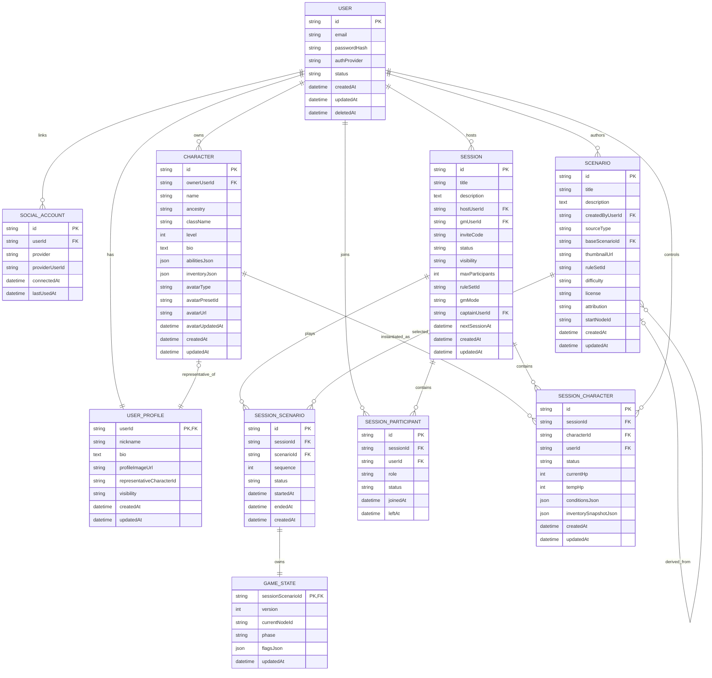

# MVP ERD - 세션 / 시나리오 런타임 서비스 모델

수정일: 2026년 5월 5일

## 문서 목적

이 문서는 MVP 단계에서 사용할 세션, 시나리오, 런타임 데이터 모델을 정리한다.

## 적용 범위

- 계정, 공개 프로필, 소셜 계정
- 세션 생성, 참가, 권한, GM 모드
- 시나리오 원본과 세션 런타임 시나리오
- 게임 상태, 공개 이력, 방문 이력, 턴 로그, 전투 상태
- 현재 Prisma 구현 기준의 런타임 DB 역할

## 핵심 요약

- 현재 구현 기준은 [현재 구현 기준 - 세션/시나리오 런타임 DB 역할](#8-현재-구현-기준---세션시나리오-런타임-db-역할)을 우선한다.
- `Session`은 사람들의 모임이고 `Scenario`는 플레이 콘텐츠다.
- 세션은 `SessionScenario`를 통해 시나리오를 플레이한다.
- 원본 장면은 `ScenarioNode`, 세션 진행 중 장면은 `SessionScenarioNode`가 맡는다.
- 세션 권한은 `hostUserId`, `gmUserId`, `captainUserId`를 분리한다.
- `GameState`는 현재 위치와 phase 같은 짧은 포인터를 맡고, 공개/방문/로그 이력은 별도 테이블이 맡는다.

## 상세 내용

특히 아래 범위를 대상으로 한다.

- 회원 / 계정 / 공개 프로필
- 세션 생성 / 탐색 / 참가 / 유지
- 시나리오 선택 및 진행 이력
- 영속 캐릭터 / 세션 런타임 캐릭터
- 최소한의 게임 상태 연결

> 현재 Prisma 구현 기준의 세션 / 시나리오 / 플레이 런타임 DB 역할과 컬럼 책임은
> [8. 현재 구현 기준 - 세션/시나리오 런타임 DB 역할](#8-현재-구현-기준---세션시나리오-런타임-db-역할)을 우선 기준으로 본다.
> 앞쪽 초안 섹션은 결정 배경을 보존하기 위한 참고 자료이며, 구현 기준과 충돌하면 8장을 우선한다.

## 2. 이번 합의의 핵심

### 2.1 세션과 시나리오

- `Session`은 사람들의 모임 / 파티 / 방이다.
- `Scenario`는 플레이할 콘텐츠다.
- 세션은 먼저 생성되고, 시나리오는 그 세션이 가져와서 플레이한다.
- 한 세션은 여러 시나리오를 순서대로 플레이할 수 있다.
- 따라서 `Session`과 `Scenario`는 직접 1:1 또는 1:N으로 묶지 않고 `SessionScenario`로 연결한다.

### 2.2 Host / Owner / GM

- `hostUserId`는 세션을 만든 방장 / 주최자다.
- `gmUserId`는 사람 GM 세션에서 GM 권한을 가진 사용자다.
- `captainUserId`는 파티 대표 또는 진행 보조 역할을 맡는 사용자다.
- `gmMode = HUMAN`이면 사람 GM 전용 기능은 `gmUserId` 기준으로 노출한다.
- `gmMode = AI`이면 GM 역할은 AI가 수행하고, host는 방 관리자이자 주최자 역할을 맡는다.

### 2.3 Account 와 Profile

- `User`는 인증 / 계정 정보 전용이다.
- `UserProfile`은 공개 프로필 전용이다.
- `/account`와 `/users/:userId`의 책임 분리를 DB에도 반영한다.

### 2.4 일정 정보

- 다음 일정은 작은 편의 기능으로만 둔다.
- 세션 생성 / 수정 시 `nextSessionAt`을 선택적으로 입력할 수 있다.
- 필수 입력은 아니다.

### 2.5 캐릭터 이미지

- MVP에서는 캐릭터 대표 이미지를 지원한다.
- 프리셋 이미지 선택 + 사용자 업로드 이미지를 모두 허용한다.
- 복잡한 별도 미디어 테이블 대신 `Character`에 직접 컬럼을 둔다.

### 2.6 시나리오 작성 흐름

- AI GM 모드에서는 시스템이 제공하는 짧은 기본 시나리오를 우선 사용한다.
- Human GM 모드에서는 아래 세 가지 흐름을 허용하는 방향으로 본다.
    1. 기존 시나리오를 그대로 사용
    2. 기존 시나리오를 불러와 복제 후 수정
    3. 시나리오와 노드를 처음부터 직접 생성
- 원본 공유 시나리오를 세션별 커스텀 과정에서 직접 수정하지 않도록, 시나리오 원본과 파생본을 구분할 수 있어야 한다.

## 3. 테이블별 컬럼 초안

아래 표는 MVP 기준 권장 컬럼이다. 실제 구현 시 타입명이나 enum 명은 코드 컨벤션에 맞게 조정할 수 있다.

### 3.1 User

| 컬럼명 | 타입 | 설명 |
| --- | --- | --- |
| id | string PK | 사용자 ID |
| email | string unique nullable | 로컬 로그인용 이메일. guest 계정은 null 가능 |
| passwordHash | string nullable | 로컬 로그인용 비밀번호 해시 |
| authProvider | enum | 대표 가입 방식 (`LOCAL`, `KAKAO`, `DISCORD`, `GUEST`) |
| status | enum | 계정 상태 (`ACTIVE`, `DELETED`, `SUSPENDED`) |
| createdAt | datetime | 생성 시각 |
| updatedAt | datetime | 수정 시각 |
| deletedAt | datetime nullable | 탈퇴 시각 |

### 3.2 UserProfile

| 컬럼명 | 타입 | 설명 |
| --- | --- | --- |
| userId | string PK, FK -> User.id | 사용자와 1:1 |
| nickname | string unique | 공개 닉네임 |
| bio | text nullable | 자기소개 |
| profileImageUrl | string nullable | 프로필 이미지 URL |
| representativeCharacterId | string nullable FK -> Character.id | 대표 캐릭터 |
| visibility | enum | 공개 범위 (`PUBLIC`, `PRIVATE`) |
| createdAt | datetime | 생성 시각 |
| updatedAt | datetime | 수정 시각 |

### 3.3 SocialAccount

| 컬럼명 | 타입 | 설명 |
| --- | --- | --- |
| id | string PK | 소셜 계정 연결 ID |
| userId | string FK -> User.id | 연결된 사용자 |
| provider | enum | `KAKAO`, `DISCORD` |
| providerUserId | string | 제공자 쪽 사용자 ID |
| connectedAt | datetime | 최초 연동 시각 |
| lastUsedAt | datetime nullable | 마지막 로그인 시각 |

권장 제약:

- `(provider, providerUserId)` unique

### 3.4 Session

| 컬럼명 | 타입 | 설명 |
| --- | --- | --- |
| id | string PK | 세션 ID |
| title | string | 세션 제목 |
| description | text nullable | 세션 설명 |
| hostUserId | string FK -> User.id | 세션 생성자이자 host |
| inviteCode | string unique | 초대 코드 |
| status | enum | `RECRUITING`, `PLAYING`, `PAUSED`, `COMPLETED`, `DISBANDED` |
| visibility | enum | `PUBLIC`, `PRIVATE` |
| maxParticipants | int | 최대 참가 인원 |
| ruleSetId | string nullable | 룰셋 식별자 |
| gmMode | enum | `HUMAN`, `AI` |
| gmUserId | string nullable FK -> User.id | Human GM 세션의 사람 GM |
| captainUserId | string nullable FK -> User.id | 파티 대표 / 진행 보조 사용자 |
| nextSessionAt | datetime nullable | 다음 예정 일정 |
| createdAt | datetime | 생성 시각 |
| updatedAt | datetime | 수정 시각 |

메모:

- 현재 구현은 `hostUserId`, `gmUserId`, `captainUserId`를 분리한다.
- API projection에서 `ownerUserId`는 세션 생성자인 `hostUserId`를 의미한다.
- Human GM 세션에서는 `gmUserId`가 없으면 호환을 위해 `hostUserId`를 GM으로 간주할 수 있다.
- AI GM 세션에서는 사람 GM 전용 권한을 `hostUserId`에 자동 부여하지 않는다.
- 현재 활성 시나리오는 `SessionScenario.status = ACTIVE`로 판별한다.

### 3.5 Scenario

| 컬럼명 | 타입 | 설명 |
| --- | --- | --- |
| id | string PK | 시나리오 ID |
| title | string | 시나리오 제목 |
| description | text nullable | 시나리오 소개 |
| createdByUserId | string nullable FK -> User.id | 작성자. 시스템 시나리오면 null 가능 |
| sourceType | enum | `SYSTEM`, `USER`, `CLONED` |
| baseScenarioId | string nullable FK -> Scenario.id | 복제 기반이 된 원본 시나리오 |
| thumbnailUrl | string nullable | 대표 이미지 |
| ruleSetId | string nullable | 적용 룰셋 |
| difficulty | string nullable | 난이도 |
| license | enum | 라이선스 정보 |
| attribution | string nullable | 출처 표기 |
| startNodeId | string nullable | 시작 노드 ID |
| createdAt | datetime | 생성 시각 |
| updatedAt | datetime | 수정 시각 |

### 3.6 SessionScenario

| 컬럼명 | 타입 | 설명 |
| --- | --- | --- |
| id | string PK | 세션-시나리오 연결 ID |
| sessionId | string FK -> Session.id | 소속 세션 |
| scenarioId | string FK -> Scenario.id | 플레이할 시나리오 |
| sequence | int | 세션 내 몇 번째 시나리오인지 |
| status | enum | `PLANNED`, `ACTIVE`, `COMPLETED`, `ABANDONED` |
| startedAt | datetime nullable | 실제 시작 시각 |
| endedAt | datetime nullable | 종료 시각 |
| createdAt | datetime | 생성 시각 |

권장 제약:

- `(sessionId, sequence)` unique
- 한 세션에는 동시에 `ACTIVE` 상태의 `SessionScenario`가 1개만 존재하도록 애플리케이션 레벨에서 보장

### 3.7 SessionParticipant

| 컬럼명 | 타입 | 설명 |
| --- | --- | --- |
| id | string PK | 참가 레코드 ID |
| sessionId | string FK -> Session.id | 참가한 세션 |
| userId | string FK -> User.id | 참가 사용자 |
| role | enum | `HOST`, `PLAYER`, `SPECTATOR` |
| status | enum | `JOINED`, `LEFT`, `KICKED` |
| joinedAt | datetime | 참가 시각 |
| leftAt | datetime nullable | 이탈 시각 |

권장 제약:

- `(sessionId, userId)` unique

### 3.8 Character

| 컬럼명 | 타입 | 설명 |
| --- | --- | --- |
| id | string PK | 캐릭터 ID |
| ownerUserId | string FK -> User.id | 캐릭터 소유자 |
| name | string | 캐릭터 이름 |
| ancestry | string | 종족 / 혈통 |
| className | string | 직업 |
| level | int | 레벨 |
| bio | text nullable | 캐릭터 소개 |
| abilitiesJson | json/text | 능력치 |
| inventoryJson | json/text nullable | 인벤토리 |
| avatarType | enum | `DEFAULT`, `PRESET`, `UPLOAD` |
| avatarPresetId | string nullable | 프리셋 이미지 ID |
| avatarUrl | string nullable | 업로드 또는 최종 표시 이미지 URL |
| avatarUpdatedAt | datetime nullable | 이미지 수정 시각 |
| createdAt | datetime | 생성 시각 |
| updatedAt | datetime | 수정 시각 |

### 3.9 SessionCharacter

| 컬럼명 | 타입 | 설명 |
| --- | --- | --- |
| id | string PK | 세션 캐릭터 ID |
| sessionId | string FK -> Session.id | 소속 세션 |
| characterId | string FK -> Character.id | 원본 영속 캐릭터 |
| userId | string FK -> User.id | 현재 사용 사용자 |
| status | enum | `ACTIVE`, `RETIRED`, `DEAD`, `LEFT` |
| currentHp | int | 현재 HP |
| tempHp | int | 임시 HP |
| conditionsJson | json/text nullable | 상태 이상 |
| inventorySnapshotJson | json/text nullable | 세션 기준 인벤토리 스냅샷 |
| createdAt | datetime | 생성 시각 |
| updatedAt | datetime | 수정 시각 |

메모:

- MVP에서는 `SessionCharacter`를 `Session`에 종속시킨다.
- 나중에 시나리오별 별도 상태 분리가 필요하면 `sessionScenarioId`를 추가 검토한다.

### 3.10 GameState

| 컬럼명 | 타입 | 설명 |
| --- | --- | --- |
| sessionScenarioId | string PK, FK -> SessionScenario.id | 현재 시나리오 진행 상태 |
| version | int | 상태 버전 |
| currentNodeId | string nullable | 현재 시나리오 노드 |
| phase | enum | `LOBBY`, `EXPLORATION`, `COMBAT`, `DIALOGUE`, `REST` |
| flagsJson | json/text nullable | 진행 플래그 |
| updatedAt | datetime | 갱신 시각 |

메모:

- `GameState`는 세션 전체보다 현재 플레이 중인 `SessionScenario`에 연결하는 편이 자연스럽다.
- 이렇게 두면 같은 세션에서 다음 시나리오를 시작해도 이전 진행 상태와 구분 가능하다.
- 공개된 단서는 `GameState`에 중복 저장하지 않고 `SessionReveal`을 기준으로 한다.

## 4. MVP ERD Mermaid 코드

아래 코드는 Mermaid `erDiagram` 기준 초안이다.

## 5. 결정 배경 정리

팀원이 이 모델을 이해할 때 핵심이 되는 판단 흐름만 짧게 남긴다.

### 5.1 왜 Session 과 Scenario 를 분리했는가

- 실제 TRPG 모임은 사람들 모임이 먼저 생기고, 어떤 콘텐츠를 플레이할지는 나중에 정하는 경우가 많다.
- 같은 멤버 / 같은 방 설정을 유지한 채 다음 시나리오로 이어갈 수 있어야 자연스럽다.
- 그래서 `Session`은 파티 / 방, `Scenario`는 콘텐츠로 분리했다.
- 한 세션에서 여러 시나리오를 순서대로 플레이할 수 있도록 `SessionScenario`를 도입했다.

### 5.2 왜 Host / GM / Captain 을 분리했는가

- AI GM 세션의 방장은 방 관리자이지 사람 GM이 아니다.
- Human GM 세션의 GM 전용 패널과 운영 API는 방장 권한과 별도로 보호되어야 한다.
- 따라서 `hostUserId`는 세션 주최자, `gmUserId`는 사람 GM, `captainUserId`는 파티 대표로 분리한다.
- `gmMode = HUMAN`이면 사람 GM 권한은 `gmUserId` 기준으로 판단한다.
- `gmMode = AI`이면 AI가 GM 역할을 수행하고, host는 방 관리 담당으로 남는다.

### 5.3 왜 User 와 UserProfile 을 분리했는가

- `/account`는 비공개 계정 정보 관리 페이지다.
- `/users/:userId`는 공개 프로필 페이지다.
- 이 둘의 책임이 다르기 때문에 DB도 분리해두는 편이 명확하다.
- 인증 정보와 공개 정보가 한 테이블에 뒤섞이는 것을 피한다.

### 5.4 왜 nextSessionAt 을 작게 두었는가

- 다음 일정은 TRPG 운영상 자주 바뀌고, 즉시 확정되지 않는 경우가 많다.
- 사용자가 게임 종료 시 무조건 다음 일정을 입력해야 하는 UX는 부담이 크다.
- 따라서 작은 편의 기능으로만 두고, `Session.nextSessionAt`을 nullable 필드로 둔다.

### 5.5 왜 Character 이미지 테이블을 따로 두지 않았는가

- MVP에서는 프리셋 선택 + 업로드 이미지 정도면 충분하다.
- 이미지 전용 테이블까지 분리하면 구현 복잡도가 커진다.
- 우선 `Character`에 직접 `avatarType`, `avatarPresetId`, `avatarUrl`을 둔다.

### 5.6 왜 Scenario 와 ScenarioNode 를 별도 테이블로 유지하는가

- 시나리오는 콘텐츠 전체이고, 노드는 그 안의 개별 장면 / 분기 / 전이 지점이다.
- 따라서 `Scenario`와 `ScenarioNode`를 분리하는 편이 구조적으로 자연스럽다.
- AI GM 기본 시나리오든, Human GM의 커스텀 시나리오든 모두 같은 저장 구조를 재사용할 수 있다.

### 5.7 왜 시나리오 커스텀 시 원본을 직접 수정하지 않는가

- 하나의 시스템 시나리오를 여러 세션이 공유해서 사용할 수 있다.
- Human GM이 기존 시나리오를 바꿀 때 원본을 직접 수정하면 다른 세션까지 영향받을 수 있다.
- 따라서 “기존 시나리오 불러와 수정” 흐름은 원본 수정이 아니라 복제본 생성 후 수정 방식으로 본다.

## 6. 현재 구현 기준으로 정렬된 주요 결정

현재 Prisma / API 구현은 아래 방향으로 정렬되어 있다.

1. `Session`은 `Scenario`를 직접 참조하지 않고 `SessionScenario`를 통해 플레이 중인 시나리오를 연결한다.
2. 현재 노드와 phase는 `GameState`가 들고, 공개/방문/로그 이력은 `SessionReveal`, `SessionNodeVisit`, `TurnLog`가 맡는다.
3. 원본 시나리오 노드는 `ScenarioNode`, 세션 진행 중 복제된 노드는 `SessionScenarioNode`가 맡는다.
4. 세션 권한은 `hostUserId`, `gmUserId`, `captainUserId`를 분리한다.
5. `UserProfile`은 공개 프로필 정보를 맡고, `User`는 인증/계정 정보를 맡는다.
6. 캐릭터 이미지는 `Character` 컬럼으로 관리한다.
7. 시나리오 이미지 자산은 `ScenarioAsset`이 관리한다.

## 7. 후속 작업 추천 순서

1. 이 문서를 기준으로 ERD 합의 확정
2. Prisma schema 수정 초안 작성
3. API 명세서의 세션 / 프로필 / 캐릭터 이미지 관련 부분 정렬
4. 프론트 라우트와 화면 책임 정리
5. 마이그레이션 전략 점검

## 8. 현재 구현 기준 - 세션/시나리오 런타임 DB 역할

이 섹션은 현재 `be/prisma/schema.prisma` 기준으로 세션, 시나리오, 실제 플레이 진행에 직접 관여하는 테이블의 책임을 정리한다.

핵심 원칙:

- `Scenario` / `ScenarioNode`는 새 세션을 시작할 때 쓰는 원본 템플릿이다.
- `SessionScenarioNode`는 플레이 중인 세션이 소유하는 장면 데이터다.
- `GameState`는 현재 위치와 phase 같은 짧은 런타임 포인터만 들고, 공개/방문/로그 이력은 별도 테이블이 맡는다.
- `SessionReveal`, `SessionNodeVisit`, `TurnLog`는 현재 상태가 아니라 세션 진행 이력이다.

### 8.1 Session

역할: 사람들의 모임, 초대 코드, 모집/진행 상태, GM 모드를 담는 세션 방이다.

| 컬럼 | 역할 |
| --- | --- |
| id | 내부 세션 PK |
| publicId | URL/공개 표시에 쓰는 세션 공개 ID |
| title | 세션 제목 |
| description | 세션 설명 |
| hostUserId | 세션 생성자이자 host |
| gmUserId | Human GM 세션의 사람 GM |
| inviteCode | 초대 입장 코드 |
| status | 모집/진행/중단/완료 상태 |
| visibility | 공개/비공개 탐색 가능 여부 |
| maxParticipants | 최대 참가자 수 |
| ruleSetId | 세션에 적용할 룰셋 식별자 |
| gmMode | AI GM 또는 Human GM 모드 |
| captainUserId | 파티 대표 / 진행 보조 사용자 |
| nextSessionAt | 다음 예정 일정 |
| createdAt / updatedAt | 생성/수정 시각 |

필요 이유: 세션은 시나리오 자체가 아니라 플레이 모임의 컨테이너다. 같은 세션이 여러 `SessionScenario`를 순서대로 플레이할 수 있다.

권한 메모: Human GM 권한은 `gmMode`와 `gmUserId`를 기준으로 판단한다. AI GM 세션의 `hostUserId`에는 사람 GM 전용 권한을 자동 부여하지 않는다.

### 8.2 SessionParticipant

역할: 특정 사용자가 세션에 어떤 역할과 준비 상태로 참여 중인지 기록한다.

| 컬럼 | 역할 |
| --- | --- |
| id | 참가 레코드 PK |
| sessionId | 소속 세션 |
| userId | 참가 사용자 |
| role | HOST / PLAYER / SPECTATOR |
| status | JOINED / LEFT / KICKED |
| connectionStatus | 온라인/오프라인 표시 |
| isReady | 모집 단계 READY 상태 |
| readyAt | READY 시각 |
| joinedAt / leftAt | 참가/이탈 시각 |

필요 이유: 계정과 세션은 다대다 관계이고, 역할/접속/READY는 세션마다 달라진다.

### 8.3 Scenario

역할: 세션 시작 전 편집 가능한 원본 시나리오 템플릿이다.

| 컬럼 | 역할 |
| --- | --- |
| id | 원본 시나리오 PK |
| title | 시나리오 제목 |
| description | 소개/요약 |
| createdByUserId | 작성자. 시스템 시나리오는 null 가능 |
| sourceType | SYSTEM / USER / CLONED |
| baseScenarioId | 복제 기반 원본 |
| thumbnailUrl | 목록/상세 대표 이미지 |
| ruleSetId | 적용 룰셋 |
| difficulty | 난이도 표시 |
| license | 라이선스 |
| attribution | 출처 표기 |
| startNodeId | 시작 노드의 원본 node id |
| createdAt / updatedAt | 생성/수정 시각 |

필요 이유: 여러 세션이 같은 원본을 기반으로 시작할 수 있다. 진행 중 세션은 원본을 직접 읽지 않고 `SessionScenarioNode`를 사용한다.

### 8.4 ScenarioNode

역할: 원본 시나리오의 장면/분기 템플릿이다.

| 컬럼 | 역할 |
| --- | --- |
| id | 원본 노드 ID. 시나리오 그래프에서 참조되는 논리 ID |
| scenarioId | 소속 원본 시나리오 |
| nodeType | story / exploration / combat 등 장면 유형 |
| title | 장면 제목 |
| sceneText | 원본 장면 설명 |
| imageUrl | 장면 이미지 |
| checkOptionsJson | 원본 판정 후보. GM용 필드가 들어갈 수 있으므로 플레이어 응답에는 projection 필요 |
| transitionsJson | 다음 노드 연결/조건 |
| cluesJson | 원본 단서 목록과 공개 정책 |
| fallbackNodeId | 조건 미충족 또는 기본 이동 대상 |
| createdAt / updatedAt | 생성/수정 시각 |

필요 이유: 시나리오 제작/복제/새 세션 시작의 기준 데이터다. 세션 시작 후 장면 수정은 원본이 아니라 `SessionScenarioNode`에서 일어난다.

### 8.5 SessionScenario

역할: 세션이 어떤 원본 시나리오를 몇 번째 순서로 플레이하는지 나타내는 진행 단위다.

| 컬럼 | 역할 |
| --- | --- |
| id | 세션-시나리오 연결 PK |
| sessionId | 소속 세션 |
| scenarioId | 출처 원본 시나리오 |
| sequence | 세션 안에서 몇 번째 시나리오인지 |
| status | PLANNED / ACTIVE / COMPLETED / ABANDONED |
| startedAt / endedAt | 실제 시작/종료 시각 |
| createdAt | 생성 시각 |

필요 이유: 한 세션이 여러 시나리오를 이어서 플레이할 수 있고, `GameState`, `SessionScenarioNode`, 공개/방문/로그 이력의 상위 범위가 된다.

### 8.6 SessionScenarioNode

역할: 세션이 실제 플레이에 사용하는 세션 소유 장면 데이터다.

| 컬럼 | 역할 |
| --- | --- |
| id | 세션 노드 PK |
| sessionScenarioId | 소속 세션 시나리오 |
| originalNodeId | 복사 출처가 된 원본 `ScenarioNode.id` |
| nodeId | 세션 안에서 유지되는 논리 노드 ID. `currentNodeId`, 전이, 방문 기록에서 사용 |
| nodeType | 세션 기준 장면 유형 |
| title | 세션 기준 장면 제목 |
| sceneText | 세션 기준 장면 설명 |
| imageUrl | 세션 기준 장면 이미지 |
| checkOptionsJson | 세션 기준 판정 후보. 플레이어 API는 player-safe 필드만 노출 |
| transitionsJson | 세션 기준 다음 장면 연결 |
| cluesJson | 세션 기준 단서와 공개 정책 |
| fallbackNodeId | 세션 기준 fallback 이동 대상 |
| createdAt / updatedAt | 생성/수정 시각 |

필요 이유: 진행 중 장면/단서/텍스트는 세션에 종속된다. 원본 시나리오를 수정해도 이미 시작한 세션이 흔들리지 않도록 세션 시작 또는 GM 런타임 조작 시점에 원본 노드를 복사한다.

### 8.7 GameState

역할: 현재 위치, phase, 버전 같은 짧은 런타임 포인터를 담는다.

| 컬럼 | 역할 |
| --- | --- |
| sessionScenarioId | 현재 진행 상태가 속한 세션 시나리오 PK |
| version | 낙관적 동시성 제어용 상태 버전 |
| currentNodeId | 현재 세션 노드의 `nodeId` |
| phase | LOBBY / EXPLORATION / COMBAT / DIALOGUE / REST |
| flagsJson | 임시 플래그, GM 메시지 등 아직 테이블화하지 않은 작은 상태 |
| updatedAt | 갱신 시각 |

필요 이유: 현재 상태를 빠르게 확인하기 위한 포인터다. 공개 단서, 방문 이력, 턴 로그처럼 이력이 필요한 데이터는 여기 넣지 않는다.

### 8.8 SessionNodeVisit

역할: 세션 시나리오에서 어떤 노드를 언제 방문했는지 기록한다.

| 컬럼 | 역할 |
| --- | --- |
| id | 방문 레코드 PK |
| sessionScenarioId | 소속 세션 시나리오 |
| sessionScenarioNodeId | 실제 방문한 세션 노드 FK |
| nodeId | 조회/정렬 편의를 위한 세션 노드 논리 ID |
| firstVisitedAt | 최초 방문 시각 |
| lastVisitedAt | 마지막 방문 시각 |
| visitCount | 방문 횟수 |
| enteredByTurnLogId | 이 노드에 들어가게 만든 턴 로그 ID |

필요 이유: 플레이어에게 방문한 장면만 보여주고, on-node-visit 공개, 되돌아가기, 리플레이/요약 생성을 지원한다. 단순 `GameState.visitedNodeIdsJson`보다 이력과 무결성이 명확하다.

### 8.9 SessionReveal

역할: 단서나 공개 가능한 콘텐츠가 누구에게 언제 어떤 내용으로 공개됐는지 기록한다.

| 컬럼 | 역할 |
| --- | --- |
| id | 공개 레코드 PK |
| sessionScenarioId | 소속 세션 시나리오 |
| contentId | 공개 콘텐츠 ID. clue id 등 |
| contentKind | clue 등 콘텐츠 종류 |
| scope | party / user / character |
| recipientId | 특정 유저/캐릭터 대상일 때의 수신자 |
| recipientKey | unique 제약을 위한 정규화된 수신자 키 |
| revealedAt | 공개 시각 |
| revealedBy | system / human_gm 등 공개 주체 |
| reason | 공개 사유 |
| turnLogId | 공개를 유발한 턴 로그 |
| snapshotJson | 공개 당시 플레이어에게 보여줄 콘텐츠 snapshot |

필요 이유: 공개 여부는 단순 true/false가 아니라 대상, 시각, 주체, 사유, 당시 내용이 중요하다. 플레이어 조회는 현재 `cluesJson`이 아니라 `snapshotJson`을 기준으로 공개 내용을 렌더링한다.

### 8.10 SessionCharacter

역할: 영속 캐릭터가 특정 세션 안에서 가진 런타임 상태다.

| 컬럼 | 역할 |
| --- | --- |
| id | 세션 캐릭터 PK |
| sessionId | 소속 세션 |
| userId | 조작 사용자 |
| characterId | 원본 영속 캐릭터 |
| status | ACTIVE / RETIRED / DEAD / LEFT |
| currentHp | 현재 HP |
| tempHp | 임시 HP |
| conditionsJson | 상태 이상 |
| inventorySnapshotJson | 세션 시작/선택 시점의 인벤토리 snapshot |
| createdAt / updatedAt | 생성/수정 시각 |

필요 이유: 같은 영속 캐릭터라도 세션마다 HP, 상태 이상, 인벤토리 변화가 다르다.

### 8.11 PlayerAction

역할: 플레이어가 제출한 원문 액션 요청과 처리 큐 상태를 보관한다.

| 컬럼 | 역할 |
| --- | --- |
| id | 액션 PK |
| sessionId | 소속 세션 |
| userId | 액션 제출자 |
| sessionCharacterId | 액션 주체 세션 캐릭터 |
| rawText | 플레이어 원문 |
| inputType | TEXT / SELECT / COMMAND |
| actionScope | PARTY_SHARED / INDIVIDUAL_TURN |
| queueStatus | PENDING / PROCESSING / COMPLETED / FAILED / REJECTED |
| baseStateVersion | 제출자가 본 `GameState.version` |
| failureReason | 실패 사유 |
| clientCreatedAt | 클라이언트 기준 제출 시각 |
| processedAt | 처리 완료 시각 |
| createdAt / updatedAt | 서버 생성/수정 시각 |

필요 이유: 입력 접수와 실제 처리 결과를 분리해 재시도, 실패 추적, 동시성 검증을 가능하게 한다.

### 8.12 TurnLog

역할: 실제 플레이 턴/이벤트 로그다.

| 컬럼 | 역할 |
| --- | --- |
| id | 턴 로그 PK |
| sessionId | 소속 세션 |
| sessionScenarioId | 소속 세션 시나리오 |
| playerActionId | 원인이 된 플레이어 액션 |
| actorUserId | 행동 사용자 |
| sessionCharacterId | 행동 캐릭터 |
| turnNumber | 세션 내 턴 번호 |
| rawInput | 원문 입력 snapshot |
| structuredActionJson | 해석된 액션 snapshot |
| diceResultJson | 이 턴에 표시할 주사위 결과 snapshot |
| stateDiffJson | 이 턴에 표시할 상태 변경 snapshot |
| outcome | SUCCESS / FAILURE / IMPOSSIBLE / NO_ROLL |
| narration | 공개 서술 |
| createdAt | 생성 시각 |

필요 이유: `DiceRollLog`와 `StateDiff`가 상세 source of truth를 갖더라도, `TurnLog`는 리플레이/채팅/감사 화면에서 당시 표시할 내용을 안정적으로 담는 이벤트 로그다.

### 8.13 DiceRollLog

역할: 실제 주사위 굴림의 상세 기록이다.

| 컬럼 | 역할 |
| --- | --- |
| id | 주사위 로그 PK |
| sessionId | 소속 세션 |
| userId | 굴린 사용자 |
| expression | 굴림 식 |
| rollsJson | 개별 주사위 결과 |
| modifier | 보정치 |
| total | 최종 합계 |
| advantageState | NORMAL / ADVANTAGE / DISADVANTAGE |
| reason | 굴림 이유 |
| turnLogId | 연결된 턴 로그 |
| createdAt | 생성 시각 |

필요 이유: 주사위 결과를 별도로 조회/검증/통계화할 수 있게 한다.

### 8.14 StateDiff

역할: `GameState.version`과 세션 캐릭터 상태 변경을 연결하는 상태 변경 기록이다.

| 컬럼 | 역할 |
| --- | --- |
| id | 상태 변경 PK |
| sessionScenarioId | 소속 세션 시나리오 |
| turnLogId | 상태 변경을 만든 턴 로그 |
| baseVersion | 변경 전 상태 버전 |
| nextVersion | 변경 후 상태 버전 |
| diffJson | 실제 변경 내용 |
| reason | 변경 이유 |
| createdAt | 생성 시각 |

필요 이유: HP/상태 이상 같은 런타임 상태 변경을 재현하고, 오래된 클라이언트가 상태를 덮어쓰지 않도록 버전 이력을 남긴다.

### 8.15 Combat

역할: 현재 또는 과거 전투 한 묶음을 나타낸다.

| 컬럼 | 역할 |
| --- | --- |
| id | 전투 PK |
| sessionId | 소속 세션 |
| sessionScenarioId | 소속 세션 시나리오 |
| status | ACTIVE / ENDED |
| roundNo | 현재 라운드 |
| turnNo | 현재 턴 |
| currentParticipantId | 현재 차례인 전투 참가자 |
| startedAt / endedAt | 시작/종료 시각 |
| createdAt / updatedAt | 생성/수정 시각 |

필요 이유: `GameState.phase = COMBAT`만으로는 전투 순서, 라운드, 참가자를 표현할 수 없다.

### 8.16 CombatParticipant

역할: 전투에 참가한 플레이어 캐릭터, NPC, 몬스터의 턴 순서 snapshot이다.

| 컬럼 | 역할 |
| --- | --- |
| id | 전투 참가자 PK |
| combatId | 소속 전투 |
| entityType | PLAYER_CHARACTER / NPC / MONSTER |
| sessionCharacterId | 플레이어 캐릭터인 경우 연결 |
| nameSnapshot | 전투 표시 이름 snapshot |
| initiative | 이니셔티브 결과 |
| turnOrder | 턴 순서 |
| isAlive | 생존 여부 |
| isHostile | 적대 여부 |
| turnEndedAt | 해당 참가자의 턴 종료 시각 |
| createdAt / updatedAt | 생성/수정 시각 |

필요 이유: 전투 시작 당시의 턴 순서와 표시 정보를 안정적으로 보존한다.

### 8.17 CombatTurnState

역할: 특정 전투 라운드/턴에서 캐릭터가 액션 자원을 사용했는지 기록한다.

| 컬럼 | 역할 |
| --- | --- |
| id | 전투 턴 상태 PK |
| combatId | 소속 전투 |
| roundNo | 라운드 번호 |
| turnNo | 턴 번호 |
| sessionCharacterId | 대상 세션 캐릭터 |
| actionUsed | 액션 사용 여부 |
| bonusActionUsed | 보너스 액션 사용 여부 |
| reactionUsed | 반응행동 사용 여부 |
| additionalActionGranted | 추가 액션 부여 여부 |
| sneakAttackUsed | 해당 턴 sneak attack 사용 여부 |
| createdAt / updatedAt | 생성/수정 시각 |

필요 이유: 전투 중 액션 경제는 현재 phase만으로 표현할 수 없고, 라운드/턴 단위 이력이 필요하다.

## 관련 원칙

- [../rules/ARCHITECTURE_RULES.md](../rules/ARCHITECTURE_RULES.md): 세션/시나리오 분리, 상태 포인터와 이력 분리 원칙
- [../rules/PERMISSION_RULES.md](../rules/PERMISSION_RULES.md): 방장, 사람 GM, AI GM 권한 분리 원칙
- [../rules/CONTENT_LICENSE_RULES.md](../rules/CONTENT_LICENSE_RULES.md): 시나리오 원본과 콘텐츠 라이선스 원칙

## 관련 문서

- [RUNTIME_SESSION_TURN_FLOW.md](RUNTIME_SESSION_TURN_FLOW.md): 런타임 상태 변경 흐름
- [PRODUCT_SCOPE.md](PRODUCT_SCOPE.md): MVP 범위와 세션/시나리오 전제
- [SCREEN.md](SCREEN.md): 화면별 권한과 상태 표시 구조

## 변경 시 주의사항

- Prisma schema, domain mapper, DTO projection과 충돌하지 않는지 확인한다.
- 권한 관련 필드를 바꾸면 `PERMISSION_RULES.md`와 사람 GM API 권한 검사를 함께 확인한다.
- 현재 구현 기준과 과거 초안이 충돌하면 현재 구현 기준을 우선하고, 과거 내용은 참고로만 남긴다.
