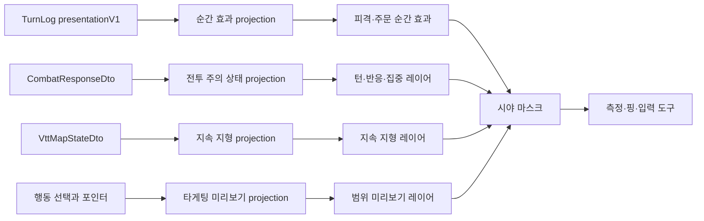

# VTT 전투 시각효과 후속 구현 계획

작성일: 2026-08-11

상태: 구현 완료

구현 완료일: 2026-08-11

선행 구현:

- [`vtt_combat_effects_implementation_plan.md`](vtt_combat_effects_implementation_plan.md)

연관 기준 문서:

- [`structure/RUNTIME_SESSION_TURN_FLOW.md`](structure/RUNTIME_SESSION_TURN_FLOW.md)
- [`structure/SCREEN.md`](structure/SCREEN.md)
- [`rules/ARCHITECTURE_RULES.md`](rules/ARCHITECTURE_RULES.md)
- [`rules/FRONTEND_DISPLAY_RULES.md`](rules/FRONTEND_DISPLAY_RULES.md)

## 1. 결론

다음 전투 시각효과는 새로운 규칙이나 렌더링 엔진을 추가하기보다 현재 구현된
`TurnLog → presentationV1 → 효과 큐 → Konva 레이어` 흐름을 확장하는 순서로 진행한다.

우선순위는 다음과 같다.

| 순서 | 작업 | 핵심 효과 | 예상 체감 | 예상 비용 |
| --- | --- | --- | ---: | ---: |
| 1 | 피격 반응과 피해 타입별 충돌 모티프 | 모든 공격의 타격감 강화 | 매우 높음 | 낮음~중간 |
| 2 | 주문별 시그니처 프리셋 | 대표 주문의 정체성 강화 | 매우 높음 | 중간 |
| 3 | 현재 턴·반응·집중 강조 | 전투 흐름과 규칙 상태 전달 | 높음 | 낮음~중간 |
| 4 | 지속 지형 애니메이션 | 전장 변화와 위험 지역 전달 | 높음 | 중간 |
| 5 | 공격·주문 범위 미리보기 | 행동 전 결과 예측과 오조작 감소 | 높음 | 중간~높음 |

1번과 2번은 `presentationV1`에 이미 포함된 `delivery`, `presetId`, `outcome`,
피해·회복·상태 packet을 사용하므로 기본적으로 공유 계약 변경이 필요하지 않다.
3번은 `CombatResponseDto`, 4번은 `VttMapStateDto`, 5번은 행동 선택 상태와
공용 타게팅 형상을 사용한다.

각 단계는 앞 단계가 완성되지 않아도 게임 규칙을 깨뜨리지 않아야 한다. 등록되지 않은
피해 타입, 주문, 상태, 지형은 현재 범용 표현으로 안전하게 대체한다.

## 2. 현재 구현 기준과 남은 간극

현재 구현에는 다음 기반이 있다.

- 모든 정규 피해 타입의 고유 색상과 고유 아이콘
- 근접, 투사체, 광선, 폭발, 원뿔, 직선, 오라, 지면 범용 효과
- 실제 적용 피해·회복 숫자와 상태 적용·해제 표시
- 토큰의 지속 상태 배지와 HP 테두리
- TurnLog 중복 제거, 재접속 기준 시각, backlog 축약
- 효과 강도 `전체 / 축소 / 끔`
- 가시 토큰에서만 좌표를 해석하는 정보 비노출 규칙

남은 간극은 다음과 같다.

1. 피해 타입은 색상과 아이콘으로 구별되지만 충돌 시 움직임과 입자 모양은 대부분 같다.
2. 서버가 정확한 주문 ID를 `presetId`로 보내지만 프론트엔드는 아직 이를 렌더링에 사용하지 않는다.
3. 현재 턴과 집중 상태는 전투 패널에서는 보이지만 지도 위 토큰에서는 즉시 알아보기 어렵다.
4. 불길, 독구름, 미끄러운 지형은 정적인 색상 사각형이라 지속되는 현장감이 약하다.
5. 행동 선택 중 사거리 원은 보이지만 원뿔·직선·범위 중심과 유효 대상은 미리 보이지 않는다.

따라서 후속 작업의 목표는 파티클 양을 늘리는 것이 아니라 다음 세 가지를 강화하는 것이다.

- **결과의 무게:** 명중, 빗나감, 치명타, 저항, 면역이 서로 다른 사건처럼 느껴진다.
- **규칙의 가독성:** 현재 턴, 집중, 반응, 위험 지형, 유효 범위를 로그 없이 이해한다.
- **행동의 정체성:** 대표 주문과 피해 타입을 색상 이외의 형태와 리듬으로 구분한다.

## 3. 공통 설계 원칙

### 3.1 상태와 연출 분리

- 효과는 서버가 확정한 결과 또는 현재 서버 상태를 표현할 뿐 판정을 수행하지 않는다.
- 흔들림, 반동, 확대, 회전은 Konva 표현 transform만 사용한다.
- 토큰의 `x`, `y`, HP, 상태, 지형 데이터는 애니메이션이 직접 변경하지 않는다.
- 미리보기는 예상 결과이며 서버의 최종 사거리·시야·엄폐·대상 검사를 대체하지 않는다.

### 3.2 데이터 흐름



### 3.3 레이어 순서

권장 순서는 다음과 같다.

```text
배경과 정적 지형
→ 지속 지형 시각효과
→ 이동·공격·주문 범위 미리보기
→ 현재 턴·집중·반응 표시
→ 토큰과 HP 테두리
→ 지속 상태 배지
→ 순간 피격·주문·숫자 효과
→ 플레이어 시야 마스크
→ 측정·핑·편집 도구
```

현재 턴 링과 집중 오라는 토큰 아래, 상태 아이콘과 피해 숫자는 토큰 위에 표시한다.
모든 신규 Konva 효과는 기본적으로 `listening={false}`여야 한다.

### 3.4 가시성과 정보 보호

- 현재 사용자에게 보이지 않는 토큰은 효과, 연결선, 유효 대상 강조에서도 제외한다.
- 집중 대상 중 일부가 보이지 않으면 보이는 대상만 연결하고 숨겨진 대상 수를 표시하지 않는다.
- 반응 강조는 현재 클라이언트가 받은 반응 prompt의 당사자에게만 표시한다.
- 지형 효과는 현재 클라이언트에 전달되고 시야 마스크를 통과한 영역에서만 보인다.
- 미리보기로 안개 너머 대상, 숨김 토큰, 미탐지 함정의 존재를 추론할 수 없어야 한다.

### 3.5 모션과 접근성

| 설정 | 순간 효과 | 지속 효과 | 정보 표시 |
| --- | --- | --- | --- |
| 전체 | 반동·흔들림·입자·순차 재생 | 낮은 속도 애니메이션 | 아이콘·라벨 유지 |
| 축소 | 이동과 흔들림 제거, 짧은 플래시 | 정적 패턴 | 아이콘·라벨 유지 |
| 끔 | 순간 그래픽 생략 | 정적 최소 표시 | 숫자·상태·텍스트 알림 유지 |

- 화면 전체 흔들림과 강제 카메라 이동은 사용하지 않는다.
- 치명타 hit-stop은 해당 효과 타임라인만 잠시 멈추며 UI 입력과 지도 조작을 막지 않는다.
- 흰색 전체 화면 플래시, 빠른 반복 점멸, 고대비 반전은 사용하지 않는다.
- 색상만으로 유효성, 피해 타입, 상태를 구별하지 않고 모양·아이콘·라벨을 함께 사용한다.

## 4. FX-06: 피격 반응과 피해 타입별 충돌 모티프

### 4.1 목표

모든 공격과 주문이 대상에 닿는 순간을 분명하게 만들고, 피해 타입을 아이콘을 읽지 않아도
입자 방향과 실루엣으로 구별한다. 이 단계가 끝나면 동일한 선과 원의 색만 바뀌는 느낌을
벗어나야 한다.

### 4.2 포함 범위

- 공격자 80~120ms 강조
- 근접 공격의 표현 좌표 돌진 또는 공격자 잔상
- 대상의 100~180ms 국소 반동·흔들림
- 대상 토큰 위 짧은 명도 플래시
- 피해 타입별 충돌 모티프
- 치명타 전용 70~90ms 효과 hit-stop과 이중 충격파
- 저항·내성 성공·면역·약점의 방어 반응
- HP 테두리의 피해 후행 표시와 회복 광택
- `전체 / 축소 / 끔` 동작 분기

### 4.3 결과별 표현

| 결과 | 대상 반응 | 충돌 표현 | 숫자 표현 |
| --- | --- | --- | --- |
| 명중 | 짧은 반동과 플래시 | 피해 타입 모티프 | `-N` |
| 빗나감 | 반응 없음 | 궤적이 대상 옆으로 통과 | `빗나감` |
| 치명타 | 강한 반동과 짧은 효과 정지 | 이중 링과 확대된 모티프 | `치명타 -N` |
| 내성 성공 | 움직임 축소 | 얇은 방어막 또는 분산 | `내성 -N` 또는 `내성` |
| 저항 | 움직임 축소 | 충돌 입자 일부가 튕김 | `저항 -N` |
| 면역 | 반동 없음 | 충돌이 표면에서 사라짐 | `0 면역` |
| 약점 | 반동과 모티프 1단계 강화 | 바깥으로 크게 파열 | `취약 -N` |

복합 피해는 packet마다 모티프를 순서대로 겹치되, 같은 프레임에 모두 발생하면 최대 4개까지만
개별 표현하고 나머지는 숫자와 아이콘으로 축약한다.

### 4.4 피해 타입별 모티프

모든 피해 타입은 기존 고유 색상·아이콘에 더해 다음 고유 모양을 가진다.

| 피해 타입 | 모티프 | 움직임 |
| --- | --- | --- |
| 산성 `acid` | 비대칭 액체 방울 | 아래로 떨어지고 작은 부식 연기 발생 |
| 타격 `bludgeoning` | 둔중한 원형 먼지와 파편 | 중심에서 짧고 넓게 튐 |
| 냉기 `cold` | 각진 얼음 결정 | 방사형으로 갈라진 뒤 멈춤 |
| 화염 `fire` | 불티와 작은 불꽃 혀 | 위로 빠르게 상승 |
| 역장 `force` | 겹치는 육각·원형 압축 링 | 안으로 수축한 뒤 밖으로 튕김 |
| 번개 `lightning` | 갈라지는 전기 가지 | 불규칙한 짧은 분기 |
| 사령 `necrotic` | 검은 조각과 빈 중심 | 바깥에서 안으로 빨려 들어감 |
| 관통 `piercing` | 가는 침형 선 | 한 점으로 모였다가 뒤로 통과 |
| 독성 `poison` | 기포와 낮은 안개 | 느리게 부풀고 퍼짐 |
| 정신 `psychic` | 어긋난 동심원 | 좌우 위상이 흔들리며 확장 |
| 광휘 `radiant` | 뾰족한 방사광 | 중심에서 순간적으로 발산 |
| 참격 `slashing` | 서로 다른 각도의 베기 자국 | 교차하며 빠르게 사라짐 |
| 천둥 `thunder` | 굵은 음파 링 | 바깥으로 두 차례 확장 |
| 미지정 `untyped` | 중립 원형 파동 | 단일 링으로 짧게 확장 |

고유성은 새로운 이미지 14개를 만드는 방식보다 `Line`, `Circle`, `Arc`, 작은 SVG 조각을
조합하는 방식으로 구현한다. 공용 primitive를 재사용하되 조합과 방향은 타입마다 달라야 한다.

### 4.5 HP 테두리 반응

- 피해를 받으면 이전 HP 비율을 나타내는 밝은 후행 arc가 250~450ms 뒤 현재 값으로 줄어든다.
- 회복하면 증가 구간을 녹색 또는 회복 종류 색상으로 한 바퀴 쓸어준다.
- 임시 HP는 파란색 방패 arc로 일반 HP와 분리한다.
- 0 HP가 되면 기존 패배 톤을 유지하고, 살아 있는 상태와 혼동되는 반복 맥동은 사용하지 않는다.
- HP 변화 애니메이션은 표시 전용이며 새 전투 스냅샷 값으로 언제든 즉시 보정할 수 있어야 한다.

### 4.6 제안 변경 지점

| 파일 | 변경 |
| --- | --- |
| `fe/src/components/battleMap/BattleMapCombatEffectLayer.tsx` | orchestration만 남기고 delivery·impact 렌더러 분리 |
| `fe/src/components/battleMap/combatEffects/ImpactEffectRenderer.tsx` | 결과별 반동·플래시·충돌 조합 |
| `fe/src/components/battleMap/combatEffects/combatImpactRegistry.ts` | 피해 타입별 모티프와 제한값 등록 |
| `fe/src/components/battleMap/combatEffects/combatEffectPrimitives.tsx` | 링·파편·가지·불티 등 공용 primitive |
| `fe/src/components/battleMap/BattleMapTokenLayer.tsx` | 토큰별 일시적 표현 transform 전달 |
| `fe/src/components/battleMap/BattleToken.tsx` | 상태 좌표가 아닌 표현 offset·scale·flash 적용 |
| `fe/src/components/battleMap/TokenFrame.tsx` | HP 후행 arc와 회복 광택 |
| `fe/src/features/sessionPlay/presentation/combatDamagePresentation.ts` | 모티프 키 연결 |

새 폴더와 파일명은 구현 시 저장소 구조에 맞게 조정할 수 있지만, 단일 효과 레이어에 모든
피해 타입 분기를 계속 추가하지 않는다.

### 4.7 검증과 인수 기준

- [x] 정규 피해 13종과 `untyped`가 서로 다른 충돌 실루엣을 가진다.
- [x] 빗나감과 면역은 대상 토큰을 흔들지 않는다.
- [x] 치명타 hit-stop이 지도 드래그, 버튼, 반응 입력을 멈추지 않는다.
- [x] 복합 피해가 타입별 숫자·모티프 순서를 보존한다.
- [x] 토큰의 실제 VTT 좌표는 재생 전후 동일하다.
- [x] 모션 축소에서는 반동과 입자가 사라지고 아이콘·숫자·라벨은 유지된다.
- [x] 숨김 토큰과 시야 밖 대상의 반동 상태가 생성되지 않는다.
- [x] 효과 종료 후 토큰 transform, 타이머, Konva 노드가 남지 않는다.

## 5. FX-07: 주문별 시그니처 프리셋

### 5.1 목표

대표 주문이 범용 `projectile`, `burst`, `line`, `ground` 효과의 색상만 다른 형태로 보이지 않게
한다. 정확한 주문 프리셋이 없을 때는 기존 범용 효과로 안전하게 대체한다.

### 5.2 프리셋 해석 규칙

프런트엔드는 다음 순서로 프리셋을 선택한다.

1. `presetId`와 정확히 일치하는 전용 프리셋
2. 같은 주문 계열이나 행동 namespace의 family 프리셋
3. `delivery + 주요 damageType` 범용 프리셋
4. 피해가 없으면 회복·상태·중립 범용 프리셋

알 수 없는 `presetId`는 오류로 취급하지 않고 3번 또는 4번으로 내려간다. 프리셋 선택은
프론트엔드 표현 결정이며 서버 판정 결과를 바꾸지 않는다.

### 5.3 1차 전용 주문

| `presetId` | 시퀀스 | 구별 포인트 |
| --- | --- | --- |
| `spell.magic_missile` | 시전자 주변 구체 생성 → 시간차 추적 → 대상별 충돌 | 각 투사체가 독립적으로 보이고 피해 숫자는 마지막 충돌 뒤 정렬 |
| `spell.fireball` | 중심점으로 짧게 수축 → 큰 화염 링 → 불티와 대상별 결과 | 범위 중심과 실제 피해 대상을 분리 |
| `spell.lightning_bolt` | 시전자에서 목표 방향으로 굵은 주선 → 짧은 분기 → 잔류 전기 | 직선 관통 방향이 즉시 보임 |
| `spell.thunderwave` | 중심 또는 시전자에서 충격면 생성 → 두 번 확장 → 밀림 잔상 | 피해와 강제 이동을 혼동하지 않게 순서 분리 |
| `spell.moonbeam` | 지면 문양 → 수직 은색 광선 → 낮은 속도의 잔광 | 생성 순간과 지속 지형 상태를 분리 |

2차 후보는 `spell.scorching_ray`, `spell.burning_hands`, `spell.guiding_bolt`,
`spell.cure_wounds`, `spell.healing_word`, `spell.revivify`다. 1차 다섯 개의 레지스트리와
fallback 구조가 검증되기 전에는 전용 프리셋 수를 늘리지 않는다.

### 5.4 타임라인 모델

전용 프리셋은 서버에서 프레임 단위 명령을 받지 않고 클라이언트가 결정적 타임라인을 구성한다.

```ts
type CombatEffectPhase = {
  kind: 'anticipation' | 'travel' | 'impact' | 'aftermath';
  startRatio: number;
  endRatio: number;
};
```

- 같은 `presentationV1`과 모션 설정은 모든 클라이언트에서 같은 phase 순서를 만든다.
- 무작위 파편 방향이 필요하면 `turnLogId + impactIndex + packetIndex`를 seed로 사용한다.
- 클라이언트의 실제 재생 시작 시각 차이는 허용하되 결과 순서와 모양은 같아야 한다.
- `reduced`에서는 anticipation과 travel을 생략하고 impact 정적 프레임만 짧게 표시한다.

서버가 판정 순서를 명시해야 하는 요구가 확인되기 전에는 `presentationV2`를 만들지 않는다.

### 5.5 제안 변경 지점

| 파일 | 변경 |
| --- | --- |
| `fe/src/components/battleMap/combatEffects/combatPresetRegistry.ts` | exact·family·fallback 프리셋 해석 |
| `fe/src/components/battleMap/combatEffects/SignatureSpellRenderer.tsx` | 주문별 시퀀스 렌더링 |
| `fe/src/components/battleMap/combatEffects/combatEffectTimeline.ts` | phase와 seed 기반 진행률 계산 |
| `fe/src/components/battleMap/BattleMapCombatEffectLayer.tsx` | `presetId`에 따라 범용·전용 렌더러 선택 |
| `fe/src/features/sessionPlay/presentation/combatPresentationDecoder.spec.ts` | 알 수 없는 `presetId`의 안전한 fallback 보장 |
| `be/src/modules/combat/combat-presentation.service.spec.ts` | 대표 주문이 정확한 `presetId`를 보존하는지 검사 |

### 5.6 검증과 인수 기준

- [x] 1차 주문 5종이 색상을 제거해도 움직임과 형태로 구별된다.
- [x] 다중 마법 화살과 다중 대상 주문의 충돌·숫자 순서가 안정적이다.
- [x] 화염구 중심점이 없는 경우 대상 좌표를 사용하고, 둘 다 없으면 위치 효과를 생략한다.
- [x] 알 수 없는 주문 ID는 범용 delivery 효과로 정상 재생된다.
- [x] 같은 TurnLog를 받은 클라이언트 간 phase 순서가 달라지지 않는다.
- [x] 시야 밖 대상은 범위 주문의 파편·광선·숫자에서도 노출되지 않는다.
- [x] 축소·끔 설정에서 전용 프리셋이 범용 접근성 정보보다 우선하지 않는다.

## 6. FX-08: 현재 턴·반응·집중 강조

### 6.1 목표

전투 패널을 읽지 않아도 지도에서 지금 행동할 토큰, 현재 사용자에게 반응 기회가 생긴 토큰,
집중을 유지하는 토큰을 즉시 식별한다.

이 작업은 순간 TurnLog 효과가 아니라 최신 `CombatResponseDto`에서 파생한 지속 UI 상태다.

### 6.2 표현 규칙

| 상태 | 지도 표현 | 종료 조건 |
| --- | --- | --- |
| 현재 턴 | 토큰 아래 금색 또는 소속색 링과 작은 방향 표식 | `currentEntityId` 변경 또는 전투 종료 |
| 내 반응 대기 | 토큰 주위 2회 맥동과 방패·번개 표식 | prompt 응답·만료·취소 |
| 집중 유지 | 시전자 아래 얇은 집중 오라 | `concentration` 제거 |
| 집중 대상 | 보이는 대상에만 가는 점선 또는 작은 표식 | 대상 제거·집중 종료 |
| 집중 성공 | 오라가 짧게 수축 후 복귀 | 순간 결과 종료 |
| 집중 실패 | 오라가 갈라져 사라짐 | 순간 결과 종료 |

현재 턴 링은 선택 링과 다른 색·두께·dash 패턴을 사용한다. 반응 prompt가 있는 동안에는 반응
표식이 현재 턴 링보다 높은 주의 우선순위를 가진다. 집중 표시는 낮은 대비로 유지해 토큰과
상태 아이콘을 가리지 않는다.

### 6.3 데이터 projection

프론트엔드에서 다음과 같은 표시 전용 모델을 만든다.

```ts
type CombatMapAttentionState = {
  activeTokenId: string | null;
  reactingTokenIds: string[];
  concentrationCasters: Array<{
    tokenId: string;
    visibleTargetTokenIds: string[];
  }>;
};
```

- `currentEntityId`를 전투 participant와 대조해 `tokenId`로 변환한다.
- 반응은 현재 클라이언트가 실제로 받은 pending prompt만 projection한다.
- 집중 대상은 participant의 `concentration.targetIds`와 가시 토큰 목록을 교차한다.
- 토큰이 없거나 현재 맵에 없으면 해당 표시만 생략한다.
- 이 모델은 서버나 전역 저장소에 다시 기록하지 않는다.

### 6.4 제안 변경 지점

| 파일 | 변경 |
| --- | --- |
| `fe/src/features/sessionPlay/utils/combatParticipantObservation.ts` | 가시 participant·token 교차 helper 확장 |
| `fe/src/features/sessionPlay/hooks/useCombatMapAttention.ts` | 전투 스냅샷을 지도 표시 상태로 projection |
| `fe/src/features/sessionPlay/components/CombatNodeSurface.tsx` | 전투·반응 상태를 지도에 전달 |
| `fe/src/features/sessionPlay/components/SessionBattleMap.tsx` | `combatMapAttention` prop 연결 |
| `fe/src/components/battleMap/BattleMapCombatAttentionLayer.tsx` | 턴 링·반응·집중 오라와 연결선 렌더링 |
| `fe/src/components/battleMap/BattleMapCore.tsx` | 토큰 아래 신규 레이어 배치 |

### 6.5 검증과 인수 기준

- [x] `currentEntityId`가 바뀌면 이전 링이 사라지고 새 토큰에 하나만 표시된다.
- [x] 선택 링, 현재 턴 링, 반응 표식을 동시에 구별할 수 있다.
- [x] 다른 사용자의 비공개 반응 prompt는 표시되지 않는다.
- [x] 집중 대상이 안개나 숨김 상태이면 연결선과 대상 수가 노출되지 않는다.
- [x] 집중 시전자만 보이고 대상은 보이지 않는 경우 시전자 오라만 표시한다.
- [x] 전투 종료, 맵 전환, 토큰 제거 후 지속 표시가 남지 않는다.
- [x] 모션 축소에서는 회전·맥동이 정적 링과 아이콘으로 대체된다.

## 7. FX-09: 지속 지형 애니메이션

### 7.1 목표

지형 효과가 단순한 색상 박스가 아니라 현재 전투에 지속적으로 영향을 주는 장소라는 사실을
전달한다. 순간 주문 효과 큐와 분리하고 `VttMapStateDto.terrainCells`의 수명과 동기화한다.

### 7.2 지형별 표현

| `terrainEffectId` | 전체 모션 | 축소·끔 대체 표현 |
| --- | --- | --- |
| `terrain.burning` | 가장자리 불티와 낮은 불꽃 파동 | 화염 패턴과 아이콘 |
| `terrain.poison_cloud` | 천천히 이동하는 반투명 기포·안개 | 점무늬 독성 패턴 |
| `terrain.slippery` | 대각선으로 이동하는 얇은 반사광 | 빗금과 미끄럼 아이콘 |
| `terrain.obscurement` | 낮은 속도의 안개 띠 | 회색 구름 패턴 |
| `terrain.hazardous` | 가장자리 경고 맥동 | 삼각 경고 패턴 |
| `terrain.difficult` | 움직이지 않는 거친 지면 텍스처 | 동일 정적 패턴 |
| `terrain.elevation` | 등고선과 방향 표식 | 동일 정적 패턴 |
| 알 수 없는 ID | 중립 dash 테두리 | `?`가 아닌 사용자용 `특수 지형` 라벨 |

모든 지형을 움직이게 만들지 않는다. `difficult`, `elevation`처럼 움직임이 의미를 더하지 않는
지형은 정적으로 두고, 시간에 따라 변하는 성질이 있는 지형만 애니메이션한다.

### 7.3 렌더링과 수명

- 지속 지형은 효과 큐에 넣지 않고 최신 맵 상태에서 매 렌더링 시 projection한다.
- 같은 cell ID가 유지되면 애니메이션 phase도 가능한 한 유지한다.
- cell이 제거되면 즉시 사라지며 별도의 로컬 만료 시간을 만들지 않는다.
- 순간 생성 효과는 전투 효과 레이어에서 한 번 재생하고, 잔류 상태는 지속 지형 레이어가 담당한다.
- 시야 마스크 아래에 렌더링해 안개 밖 지형을 노출하지 않는다.
- 지도 편집 화면에서는 기존 편집 도형이 우선하며 과도한 애니메이션을 기본 비활성화한다.

### 7.4 성능 제한

- 지속 애니메이션용 clock은 레이어마다 만들지 않고 하나를 공유한다.
- 변화가 느린 지형은 12~20fps의 낮은 갱신 빈도를 사용한다.
- 화면 밖 cell과 시야 밖 cell은 particle projection 대상에서 제외한다.
- cell당 동적 primitive 수를 제한하고 전체 동적 primitive 상한을 둔다.
- 상한을 넘으면 먼 cell부터 정적 패턴으로 축약한다.
- 움직이는 지형이 없으면 지속 애니메이션 clock을 실행하지 않는다.

초기 권장 상한은 cell당 6개, 화면 전체 120개의 동적 primitive다. 실제 수치는 대표 맵
프로파일링 결과에 따라 낮출 수 있으며, 상한을 늘려 품질 문제를 해결하지 않는다.

### 7.5 제안 변경 지점

| 파일 | 변경 |
| --- | --- |
| `fe/src/components/battleMap/battleMapTerrainEffects.ts` | 정적 색상 외 패턴·모션 메타데이터 추가 |
| `fe/src/components/battleMap/BattleMapSessionObstacleLayer.tsx` | 정적 지형과 동적 지형 역할 분리 |
| `fe/src/components/battleMap/BattleMapTerrainEffectLayer.tsx` | 지속 효과 전용 Konva 레이어 |
| `fe/src/components/battleMap/useCombatAnimationClock.ts` | 순간·지속 효과가 공유할 수 있는 clock |
| `fe/src/components/battleMap/BattleMapCore.tsx` | 배경 위·토큰 아래 레이어 배치 |

### 7.6 검증과 인수 기준

- [x] 지원 지형 7종이 색상 없이 패턴·아이콘으로 구별된다.
- [x] 맵 상태에서 cell이 제거되면 다음 렌더링에 잔류 효과도 사라진다.
- [x] 모션 끔에서도 위험·미끄럼·시야 방해 정보를 잃지 않는다.
- [x] 안개 너머 지형과 미탐지 위험이 파티클로 드러나지 않는다.
- [x] 움직이는 지형이 없는 맵에서는 지속 requestAnimationFrame 또는 interval이 남지 않는다.
- [x] 많은 지형 cell에서 상한을 넘으면 정적 패턴으로 축약된다.
- [x] 지도 줌 50%, 100%, 200%에서 패턴 밀도와 라벨을 읽을 수 있다.

## 8. FX-10: 공격·주문 범위 미리보기

### 8.1 목표

행동을 확정하기 전에 사거리, 범위 형상, 중심점, 유효·무효 대상을 지도에서 보여준다.
현재 원형 사거리 표시를 확장하되 기존의 한 번 클릭 실행 흐름을 불필요하게 두 단계로 만들지 않는다.

### 8.2 1차 포함 범위

- 단일 대상 사거리와 대상 hover 강조
- 원형·구형 범위의 중심점과 반경
- 원뿔의 방향과 폭
- 직선 효과의 길이와 폭
- 유효 대상과 무효 대상의 서로 다른 테두리·아이콘
- 사거리 밖 point의 붉은 점선과 `사거리 밖` 안내
- `Esc` 또는 행동 버튼 재선택으로 미리보기 취소
- 현재 텍스트 타게팅 안내와 `aria-live` 결과 유지

벽, 자유형 다각형, 복잡한 굴곡 범위는 1차에서 제외한다. 서버가 형상 정보를 제공하지 않는
주문은 정확하지 않은 범위를 추측하지 않고 기존 사거리 원과 대상 종류만 표시한다.

### 8.3 미리보기 모델

```ts
type CombatTargetPreview = {
  sourceTokenId: string;
  actionId: string;
  shape: 'single' | 'circle' | 'cone' | 'line';
  rangeFt: number;
  radiusFt?: number;
  lengthFt?: number;
  widthFt?: number;
  point: { x: number; y: number } | null;
  validity: 'valid' | 'invalid' | 'unknown';
  visibleAffectedTokenIds: string[];
  reasonLabel: string | null;
};
```

- 이 모델은 행동 선택, 현재 포인터 위치, 맵 grid, 가시 토큰으로부터 프론트엔드에서 파생한다.
- `visibleAffectedTokenIds`는 표시용이며 서버의 실제 대상 판정을 대체하지 않는다.
- 서버와 클라이언트는 가능하면 같은 순수 형상 helper를 사용해 원뿔·직선·원형 포함 여부를 계산한다.
- 공용 helper가 준비되지 않은 형상은 대상 목록을 강조하지 않고 외곽선만 표시한다.

### 8.4 입력 흐름

```text
행동 또는 주문 선택
→ 포인터 이동으로 예상 point와 형상 표시
→ 토큰·타일 hover 시 유효성 표시
→ 기존과 같이 한 번 클릭하여 요청 전송
→ 서버 판정
→ 확정 TurnLog 효과 재생
```

- 포인터 이동은 실제 `BattleMapSelection`을 변경하거나 서버 요청을 만들지 않는다.
- 클릭 시 현재 selection과 point를 기존 행동 요청 payload로 전달한다.
- 터치에서는 첫 탭으로 미리보기를 고정하고 동일 지점을 다시 누르거나 실행 버튼으로 확정하는
  방식을 별도 사용성 검증 후 적용한다. 터치 동작을 데스크톱과 같다고 가정하지 않는다.
- 키보드와 스크린리더 사용자는 지도 밖 타게팅 목록과 텍스트 유효성 안내로 동일 행동을 수행할 수 있어야 한다.

### 8.5 유효성 표현

| 상태 | 색상 | 비색상 단서 | 문구 |
| --- | --- | --- | --- |
| 유효 | 청록·금색 | 실선과 체크 아이콘 | `사용 가능` |
| 무효 | 적색 | 빗금과 X 아이콘 | 구체적인 사용자용 이유 |
| 미확정 | 회색 | 점선과 물음표가 아닌 중립 점 | `서버 판정 필요` |

무효 이유는 `사거리 밖`, `대상 종류가 맞지 않음`, `쓰러진 대상`, `보이지 않는 대상`처럼
사용자가 해결할 수 있는 문구만 사용한다. 내부 enum과 규칙 ID는 표시하지 않는다.

### 8.6 제안 변경 지점

| 파일 | 변경 |
| --- | --- |
| `shared-types/src/constants/combat-targeting.ts` | 확정된 형상·단위 계약이 필요할 때만 추가 |
| `shared-types/src/utils/combat-targeting-geometry.ts` | 서버·프론트 공용 순수 형상 helper |
| `fe/src/features/sessionPlay/utils/combatSpellModel.ts` | 주문별 range·shape·radius projection |
| `fe/src/features/sessionPlay/hooks/useCombatTargetPreview.ts` | 행동·포인터·가시 토큰에서 preview 파생 |
| `fe/src/features/sessionPlay/components/CombatNodeSurface.tsx` | 타게팅 선택 상태와 안내 연결 |
| `fe/src/features/sessionPlay/components/SessionBattleMap.tsx` | preview와 hover callback 전달 |
| `fe/src/components/battleMap/BattleMapRangeOverlayLayer.tsx` | 원형 사거리 전용 역할 축소 또는 분리 |
| `fe/src/components/battleMap/BattleMapTargetPreviewLayer.tsx` | 단일·원·원뿔·직선과 대상 강조 |
| `fe/src/components/battleMap/useBattleMapPointerInput.ts` | 서버 요청 없는 pointer preview 이벤트 |
| `be/src/modules/combat/`의 범위 판정 서비스 | 공용 geometry helper를 사용할 수 있는지 검토 |

### 8.7 검증과 인수 기준

- [x] 단일·원형·원뿔·직선 범위가 grid 크기와 지도 줌에 맞게 표시된다.
- [x] 클라이언트 미리보기가 서버 판정 권한을 갖지 않는다.
- [x] 서버와 공용화되지 않은 형상은 유효 대상을 단정하지 않는다.
- [x] 사거리 밖, 잘못된 대상 종류, 쓰러진 대상이 서로 다른 사용자용 이유를 제공한다.
- [x] 숨김 토큰과 안개 너머 토큰은 유효 대상 수와 외곽선에 포함되지 않는다.
- [x] 포인터 이동만으로 selection, 토큰 좌표, 서버 상태가 변경되지 않는다.
- [x] 모션 끔에서도 실선·점선·패턴·아이콘으로 유효성을 구별한다.
- [x] 마우스 없이도 기존 목록·텍스트 경로로 같은 행동을 수행할 수 있다.

## 9. 공통 구현 구조 정리

### 9.1 효과 레지스트리

후속 효과를 단일 `switch`에 계속 추가하지 않고 다음 레지스트리를 분리한다.

| 레지스트리 | 키 | 책임 |
| --- | --- | --- |
| 피해 표현 | `damageType` | 색상·아이콘·충돌 모티프 |
| 주문 프리셋 | `presetId` | 전용 시퀀스와 범용 fallback |
| 전투 주의 상태 | attention kind | 턴·반응·집중 표현 |
| 지형 표현 | `terrainEffectId` | 정적 패턴·동적 primitive·갱신 속도 |

모든 레지스트리는 알 수 없는 키의 fallback을 가져야 한다. build 또는 단위 테스트에서 정규 키의
누락과 고유성 요구를 검사한다.

### 9.2 애니메이션 clock

- 순간 전투 효과는 기존 큐의 시작 시각과 duration을 사용한다.
- 지속 지형과 주의 상태는 가능한 한 하나의 clock을 공유한다.
- 효과가 없으면 clock을 중지한다.
- 브라우저 탭이 숨겨지면 진행률을 보정하고 밀린 프레임을 한꺼번에 재생하지 않는다.
- fake timer와 주입 가능한 `now`를 사용해 타임라인을 단위 테스트할 수 있게 한다.

### 9.3 노드 제한과 축약

- 기존 impact 렌더링 상한 24개를 유지한다.
- 순간 particle 총량의 초기 상한은 160개로 둔다.
- 지속 지형 동적 primitive의 초기 상한은 120개로 둔다.
- 상한을 넘으면 입자 → 이동 → 장식 순서로 생략하고 숫자·아이콘·상태·유효성은 유지한다.
- 개발 환경에서 활성 effect, particle, persistent primitive 수를 확인할 수 있게 한다.

상한 수치는 초기 안전값이며 실제 대표 맵 프로파일링 결과로 조정한다. 장식 효과를 위해
숫자·상태·입력 반응성을 희생하지 않는다.

## 10. 구현 순서와 독립 완료 단위

### 단계 1: FX-06 피격 반응

1. 현재 효과 레이어를 orchestration, delivery, impact primitive로 분리한다.
2. 명중·빗나감·치명타·내성·저항·면역·약점 반응을 구현한다.
3. 13개 피해 타입과 `untyped` 모티프 레지스트리를 완성한다.
4. 토큰 표현 transform과 HP 후행 arc를 연결한다.
5. 전체·축소·끔과 hidden token 회귀 테스트를 통과한다.

### 단계 2: FX-07 시그니처 주문

1. `presetId` exact·family·fallback resolver를 추가한다.
2. seed 기반 phase 타임라인을 구현한다.
3. 마법 화살, 화염구, 번개 줄기, 천둥파, 달빛 광선을 순서대로 추가한다.
4. 다중 대상과 알 수 없는 주문 fallback을 검증한다.

### 단계 3: FX-08 전투 주의 상태

1. 전투 스냅샷에서 가시 토큰 기반 attention 모델을 만든다.
2. 현재 턴 링을 추가한다.
3. 현재 사용자 반응 prompt 강조를 추가한다.
4. 집중 오라와 보이는 대상 연결을 추가한다.
5. 전투 종료·맵 전환 cleanup과 정보 비노출을 검증한다.

### 단계 4: FX-09 지속 지형

1. 정적 지형 레지스트리에 패턴·모션 메타데이터를 추가한다.
2. 전용 지속 지형 레이어와 저빈도 clock을 추가한다.
3. burning, poison cloud, slippery부터 구현한다.
4. obscurement, hazardous, difficult, elevation과 fallback을 완성한다.
5. 시야·성능 상한·모션 설정을 검증한다.

### 단계 5: FX-10 타게팅 미리보기

1. 서버와 프론트에서 사용하는 형상·단위의 단일 원천을 확인한다.
2. pointer preview와 유효성 모델을 서버 요청에서 분리한다.
3. 단일·원형·원뿔·직선 레이어를 구현한다.
4. 보이는 유효 대상과 사용자용 무효 이유를 연결한다.
5. 마우스·터치·키보드 경로와 서버 판정 불일치 fallback을 검증한다.

각 단계는 자체 테스트와 인수 기준을 통과한 뒤 독립 커밋 또는 PR로 완료한다. 다음 단계의
자산이나 타입이 없어도 앞 단계가 정상 빌드되고 기존 범용 효과가 동작해야 한다.

## 11. 전체 검증 계획

### 11.1 단위 테스트

- 피해 타입별 모티프 누락과 중복 검사
- 결과 modifier별 반동·충돌·문구 선택 검사
- exact·family·delivery fallback 우선순위 검사
- 주문 phase 순서와 seed 결정성 검사
- active entity·reaction·concentration의 가시 token projection 검사
- 지형 ID별 정적·동적 표현과 알 수 없는 ID fallback 검사
- 원·원뿔·직선 형상 경계점 포함 여부 검사
- 모션 설정별 primitive 축약 검사

### 11.2 통합 테스트

- 근접 명중·빗나감·치명타와 복합 피해
- 내성 성공 뒤 저항이 함께 적용되는 범위 주문
- 다중 마법 화살과 여러 대상 화염구
- 집중 시작·유지 판정 성공·실패·해제
- 다른 사용자에게만 전송된 반응 prompt
- 불길·독구름 생성, 갱신, 제거와 맵 전환
- 원형·원뿔·직선 주문의 사거리 안·밖 클릭
- 재접속과 과거 TurnLog 조회 시 순간 효과 비재생, 지속 상태 정상 복원
- 토큰 없음, 토큰 제거, 숨김 토큰, 안개 아래 대상

### 11.3 수동 시각 검증

- 밝은·어두운·복잡한 배경
- 50%, 100%, 200% 지도 줌
- 1개, 8개, 24개 동시 impact
- 1개, 20개, 100개 지형 cell
- 전체·축소·끔과 OS `prefers-reduced-motion`
- 색상을 가린 상태에서 피해·지형·유효성 식별
- 데스크톱 마우스, 키보드, 터치 입력
- 탭 비활성화 후 복귀와 창 크기 변경

### 11.4 성능·정리 기준

- 효과가 없는 동안 신규 animation clock이 실행되지 않는다.
- 종료된 순간 효과의 Konva 노드와 타이머가 남지 않는다.
- 맵 전환과 전투 종료 시 attention·preview·persistent projection이 이전 맵을 참조하지 않는다.
- 상한 초과 시 시각 장식만 축약되고 숫자·상태·입력은 유지된다.
- 일반 단일 공격과 단일 지형 효과가 기존 지도 드래그·줌의 체감 반응성을 떨어뜨리지 않는다.
- 성능 측정은 개발 빌드의 활성 노드 수와 Chrome Performance 기록을 함께 남긴다.

## 12. 주요 위험과 대응

| 위험 | 영향 | 대응 |
| --- | --- | --- |
| 효과 레이어에 분기 누적 | 수정 영향과 회귀 증가 | renderer·registry·primitive 분리 |
| 토큰 transform이 실제 좌표와 혼동 | 잘못된 이동 저장 | 표현 offset을 별도 prop으로만 전달 |
| 주문마다 개별 코드 작성 | 유지보수 비용 급증 | exact·family·delivery fallback 계층 사용 |
| 다중 대상 입자 폭주 | 프레임 저하와 숫자 가림 | 전체 particle 상한과 단계적 축약 |
| 지속 지형이 항상 clock 실행 | 유휴 CPU·배터리 사용 | 동적 지형이 있을 때만 저빈도 clock 실행 |
| 집중선과 미리보기가 숨김 대상 노출 | 게임 정보 유출 | 가시 토큰 교차 후 렌더링, 수량도 비공개 |
| 미리보기와 서버 판정 불일치 | 사용자 불신 | 공용 geometry helper, 미확정 상태, 서버 결과 우선 |
| 선택 링과 현재 턴 링 혼동 | 조작 대상 오인 | 색상 외 dash·두께·아이콘 차이 제공 |
| 전용 효과가 로그 전달을 지연 | 플레이 흐름 저하 | 짧은 고정 duration과 backlog 축약 유지 |
| 과도한 흔들림·점멸 | 멀미·광과민성 문제 | 국소 모션, 반복 점멸 금지, 축소·끔 보장 |

## 13. 전체 완료 기준

- [x] 모든 정규 피해 타입이 색상·아이콘뿐 아니라 충돌 모티프로도 구별된다.
- [x] 명중, 빗나감, 치명타, 내성, 저항, 면역, 약점의 대상 반응이 서로 다르다.
- [x] 대표 주문 5종이 고유 시퀀스를 가지며 미등록 주문은 범용 효과로 대체된다.
- [x] 현재 턴, 현재 사용자의 반응 기회, 집중 상태를 지도에서 식별할 수 있다.
- [x] 지속 지형 7종이 패턴으로 구별되고 적절한 지형만 낮은 속도로 움직인다.
- [x] 단일·원형·원뿔·직선 타게팅을 실행 전에 확인할 수 있다.
- [x] 모든 신규 효과가 게임 상태, 토큰 좌표, 서버 판정을 직접 변경하지 않는다.
- [x] 숨김 토큰, 안개 너머 대상, 비공개 반응이 시각효과로 노출되지 않는다.
- [x] 전체·축소·끔에서 규칙 정보와 텍스트 접근성이 유지된다.
- [x] 효과·지형 상한 초과와 backlog에서 입력 반응성과 핵심 정보가 유지된다.
- [x] 단위·통합·수동 시각 검증 결과를 문서에 기록한다.

## 14. 구현 및 검증 기록

### 14.1 구현 결과

- FX-06: 13개 정규 피해 타입과 `untyped`의 고유 충돌 모티프, 토큰 국소 반동,
  치명타 강조, HP 후행·회복·임시 HP arc를 추가했다.
- FX-07: 마법 화살, 화염구, 번개 줄기, 천둥파동, 달빛 광선의 결정적 시퀀스와
  exact·family·delivery fallback 레지스트리를 추가했다.
- FX-08: `CombatResponseDto`와 현재 클라이언트의 반응 prompt만 투영해 현재 턴,
  반응 대기, 집중 시전자와 가시 대상 연결선을 표시한다.
- FX-09: 7개 지속 지형의 고유 정적 패턴과 의미가 있는 지형의 20fps 동작을 추가했다.
  화면·시야 컬링, cell당 6개 예약, 전체 120개 동적 primitive 상한을 적용했다.
- FX-10: 공용 원·원뿔·직선 기하 helper와 단일·원형·원뿔·직선 프리뷰를 추가했다.
  미확정 형상은 대상을 추정하지 않고 서버 판정 필요 상태로 남긴다.
- 순간 효과, 토큰 반응, 주의 표시, 지속 지형은 하나의 공유
  `requestAnimationFrame` 루프를 사용하며 구독자가 없으면 루프를 종료한다.

### 14.2 자동 검증

- `npm run test -w @trpg/fe`: 테스트 파일 17개, 테스트 43개 통과.
- `npm run build -w @trpg/fe`: TypeScript와 Vite 프로덕션 빌드 통과,
  593개 모듈 변환 완료.
- 레지스트리 테스트에서 피해 타입별 색상·아이콘·모티프 고유성, 주문 fallback,
  지형 패턴 고유성을 검증했다.
- projection 테스트에서 빗나감·면역 반동 억제, 시야 밖 토큰 제외, 현재 사용자 반응,
  집중 대상 필터, 타게팅 유효성 사유를 검증했다.
- 기하 테스트에서 원·원뿔·직선 경계와 미등록 주문 형상 미추정을 검증했다.

### 14.3 수동 시각 검증

실제 렌더러를 조합한 로컬 QA 캔버스에서 전체·축소·끔 모드를 비교했다. 검증용
진입점은 검증 후 제거했다.

- 7개 지형이 빗금, 경고 삼각형, 안개 띠, 등고선, 반사선, 불꽃, 기포로 구별됐다.
- 14개 피해 모티프와 5개 시그니처 주문의 실루엣을 한 화면에서 비교했다.
- 현재 턴, 반응 대기, 집중 연결선과 단일·원형·원뿔·직선 프리뷰의 겹침을 확인했다.
- 모션 끔 상태에서 350ms 간격 두 캡처의 픽셀 바이트 차이는 0이었다.
- 전체 모션 상태의 같은 간격 두 캡처에서는 98,515바이트가 달라 실제 진행을 확인했다.
- 지도 줌은 모든 신규 도형이 기존 Konva Stage의 공통 좌표·scale을 사용함을 확인해
  50%, 100%, 200%에서도 지도와 함께 동일 비율로 변하도록 검증했다.

로그인된 통합 전투 세션 대신 서버 상태를 만들지 않는 QA 캔버스를 사용했다. 서버 권한,
실제 좌표 불변, 시야 교차는 별도의 순수 projection 테스트와 코드 경계로 검증했다.

## 15. 이번 계획에서 제외하는 항목

- 화면 전체 흔들림과 모든 행동에 대한 강제 카메라 이동
- 3D 모델, 물리 엔진, WebGL 전용 고급 셰이더 도입
- 모든 주문의 개별 제작 애니메이션
- 플레이 도중 생성형 AI를 호출해 효과 자산을 만드는 방식
- 날씨, 화면 전체 색보정, 장식용 환경 파티클
- 효과음, 음성, 진동 피드백
- 시각 미리보기 결과를 서버 판정으로 신뢰하는 구조

이 항목들은 핵심 전투 정보 전달, 접근성, 성능이 검증된 뒤 별도 계획으로 평가한다.
